# nao Cloud billing with Stripe

This document describes the architecture, configuration, rollout, and operational rules for organization billing in nao Cloud.

## Product contract

- Billing is owned by an organization, never by a user or cloud instance.
- Every eligible cloud organization can activate one 14-day trial when an admin is ready.
- The initial plan is EUR 2,000 per month with unlimited users.
- Stripe subscription quantity is always `1`.
- Organization admins can subscribe, manage payment details, view invoices, cancel, and recover a paused subscription.
- Billing restrictions preserve organizations, projects, users, chats, stories, files, and analytics data.
- Self-hosted deployments never construct a Stripe client or enforce cloud billing.
- The instance-wide license system is not a cloud subscription source of truth.

Cloud billing is active only when both conditions are true:

```env
NAO_MODE=cloud
CLOUD_BILLING_ENABLED=true
```

When disabled, billing tRPC procedures return `NOT_FOUND`, raw Stripe routes and billing jobs are not registered, and application access remains unrestricted.

## System map

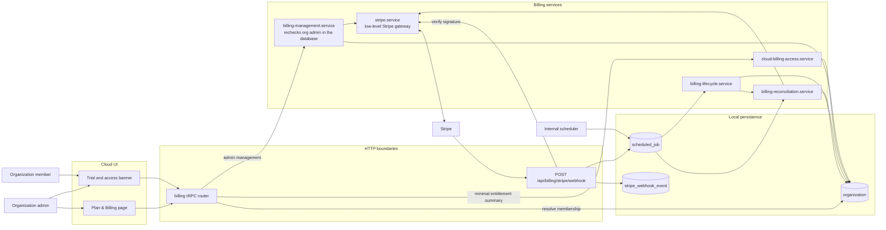

There are two intentional trust paths. Interactive billing-management requests must pass both the tRPC admin middleware and the independent database-backed admin check in `billing-management.service.ts`. The member-readable entitlement summary does not expose Stripe or invoice data. Signed Stripe webhooks and internal scheduled jobs do not impersonate a user; they use the lower-level Stripe gateway and validate object ownership during reconciliation.

## Stripe configuration

### Product and Price

Create one Stripe Product named `nao Cloud` and one recurring Price:

- currency: `EUR`
- unit amount: `200000`
- interval: monthly
- usage type: licensed
- quantity: `1`
- lookup key: `nao_cloud_monthly_v3`

The lookup key tells nao which Price to sell. nao reads the amount from Stripe and checks that the Price is active, monthly, in EUR, and attached to the `nao Cloud` Product. The browser does not decide any billing values.

#### Changing the price

Stripe Prices are immutable. Changing the monthly amount means creating a replacement Price under the existing `nao Cloud` Product; it does not mean editing the Product or the current Price.

Use a new versioned lookup key for every replacement, such as `nao_cloud_monthly_v4`. Do not transfer the previous lookup key: keeping both keys makes the cutover explicit in deployment configuration and preserves a simple rollback.

To change the amount for new subscriptions:

1. Decide the new amount, tax behavior, effective date, and whether existing subscriptions will be migrated.
2. In Stripe sandbox mode, add the replacement monthly EUR Price to the existing `nao Cloud` Product. Match the licensed usage type, monthly interval, and tax behavior, and assign the next lookup key.
3. Leave the previous Price active during the rollback window.
4. Set the non-production `STRIPE_CLOUD_MONTHLY_PRICE_LOOKUP_KEY` to the replacement key and restart or redeploy nao. Environment configuration is read at startup.
5. Verify that Plan & Billing and a newly created Checkout show the replacement amount, and that a completed test subscription references the replacement Price.
6. Create the equivalent Price under the live-mode `nao Cloud` Product. Sandbox and live Price IDs differ, but they can use the same lookup key.
7. Update the production lookup-key setting, restart or redeploy, verify a new live Checkout, and monitor billing errors and webhook reconciliation.

No code or database migration is required. The cutover occurs when a Checkout session is created:

- a Checkout created after the configuration change uses the replacement Price;
- a Checkout created before the change keeps the previous Price, even if the customer completes it later;
- an existing paid or trialing subscription keeps its previous Price, including the amount charged when its trial ends.

Changing the lookup key does not migrate existing subscriptions. If existing customers should move to the replacement amount, update each subscription item separately in Stripe or use a Subscription Schedule for a future billing boundary. Decide and communicate the effective date, and explicitly choose the proration behavior; Stripe otherwise prorates many mid-cycle Price changes by default. Test the migration with sandbox subscriptions or test clocks before applying it in live mode. Signed webhooks and reconciliation will then update each organization's persisted `stripePriceId` and displayed subscription amount.

To roll back new sales, confirm that the previous Price is still active, restore its lookup key in `STRIPE_CLOUD_MONTHLY_PRICE_LOOKUP_KEY`, and restart or redeploy nao. This affects only Checkout sessions created after the rollback. It does not change already-created sessions or reverse subscription migrations; those require separate Stripe updates with their own proration decision.

After the rollback window, the previous Price may be deactivated so it cannot be selected for new purchases. Existing subscriptions can continue to reference an inactive Price. Keep the Product and historical Prices because reconciliation uses the shared Product to recognize both current and historical nao Cloud subscriptions.

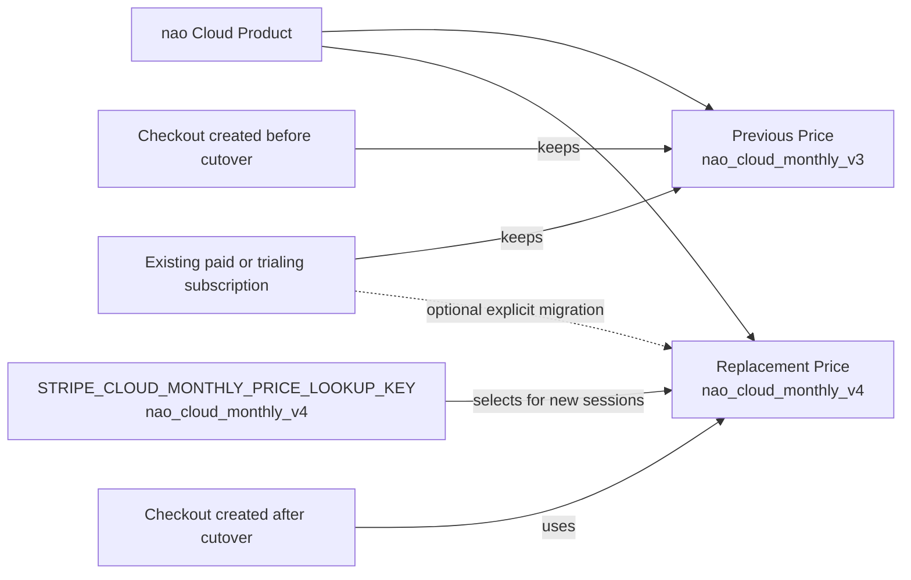

### Customer Portal

Configure the Stripe Customer Portal to:

- update payment methods, billing addresses, and tax IDs as required;
- display and download invoices;
- cancel at the end of the current period;
- preserve an active trial when subscription details are edited;
- return to `/settings/organization/billing`;
- disable plan switching while only one plan exists.

Portal sessions are short-lived and created on every authenticated admin request.

### Billing emails and retries

Stripe owns receipts, invoice documents, failed-payment recovery, payment-action messages, expiring-card notices, and cancellation confirmations. nao owns the product-specific trial-ending reminder.

Configure Smart Retries deliberately. The Stripe retry schedule determines how long a `past_due` organization remains entitled.

### Webhook destination

Register:

```text
POST https://<cloud-domain>/api/billing/stripe/webhook
```

Subscribe to:

- `checkout.session.completed`
- `checkout.session.async_payment_succeeded`
- `checkout.session.async_payment_failed`
- `customer.updated`
- `payment_method.attached`
- `payment_method.detached`
- `payment_method.updated`
- `customer.subscription.created`
- `customer.subscription.updated`
- `customer.subscription.deleted`
- `customer.subscription.paused`
- `customer.subscription.resumed`
- `customer.subscription.trial_will_end`
- `invoice.paid`
- `invoice.payment_failed`
- `invoice.payment_action_required`
- `invoice.finalization_failed`

Pin the destination to the API version used by the Stripe SDK.

## Server configuration

```env
CLOUD_BILLING_ENABLED=false
STRIPE_SECRET_KEY=
STRIPE_CLOUD_MONTHLY_PRICE_LOOKUP_KEY=nao_cloud_monthly_v3
STRIPE_WEBHOOK_SECRET=
STRIPE_PORTAL_CONFIGURATION_ID=
```

`STRIPE_SECRET_KEY`, the Price lookup key, and `STRIPE_WEBHOOK_SECRET` are required when cloud billing is enabled. The portal configuration ID is optional when the Stripe account default is suitable.

Keep sandbox and live credentials separate. Store secrets in the deployment secret manager, never in source control, logs, client bundles, database rows, or analytics.

## Data model

Billing extends the existing `organization` table:

- `billingPlan`
- `billingStatus`
- `trialStartedAt`
- `trialEndsAt`
- `stripeCustomerId`
- `stripeSubscriptionId`
- `stripePriceId`
- `currentPeriodEndsAt`
- `cancelAtPeriodEnd`
- `hasDefaultPaymentMethod`
- `billingAccessEndsAt`
- `billingUpdatedAt`
- `billingSyncToken`
- `trialReminderClaimedAt`

Supported local statuses are `trialing`, `active`, `past_due`, `unpaid`, `canceled`, `paused`, `incomplete`, and `incomplete_expired`.

Stripe Customer and Subscription IDs are unique when present. Trial timestamps remain null until a signed Stripe event confirms the Checkout-created subscription. Opening or abandoning Checkout does not grant access or consume the trial. Joining an organization, resubscribing, or renaming the organization never resets it.

The `stripe_webhook_event` table is a durable inbox containing the Event ID, type, object ID, live-mode flag, receipt time, processing time, and last error. Raw event payloads and payment details are not retained.

PostgreSQL and SQLite use the same logical migration, `0065_organization_billing`, with synchronized schema snapshots.

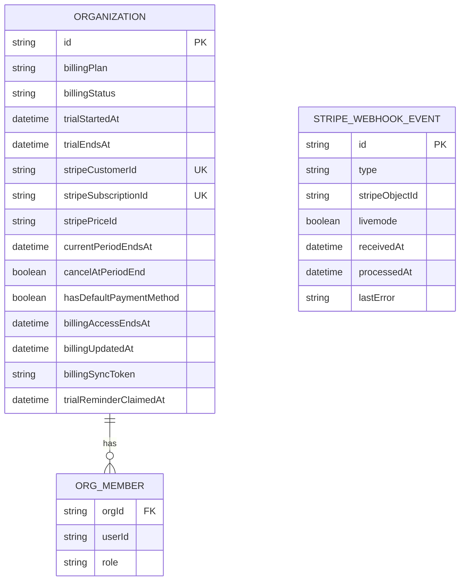

Stripe owns Products, Customers, Subscriptions, Prices, Payment Methods, and Invoices. nao stores identifiers and a queryable projection, not copies of payment data:

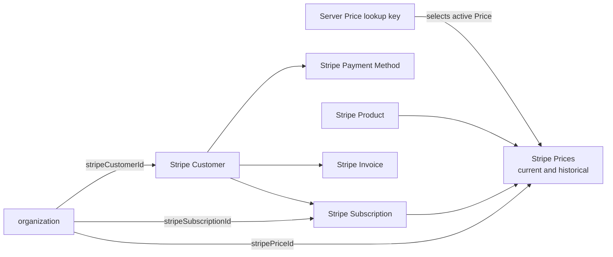

## Organization resolution

Organization-scoped requests resolve the organization from the authenticated user's selected project. Without a selected project, the user must belong to exactly one organization. An unknown selected project or ambiguous membership fails instead of falling back to an arbitrary organization.

This rule applies to billing, organization settings, API keys, and GitHub or GitLab project imports.

Cloud signup creates a personal organization and makes the new user its admin, but it does not create a project. Because the sole organization is unambiguous, that admin can open Plan & Billing, start the trial, and create an organization API key before the first project exists. Billing never operates without an organization.

## Interactive route authorization

Every billing procedure checks the feature flag and resolves organization membership before database-backed billing work. The member-readable access procedure then evaluates the persisted entitlement without exposing Stripe data. Management procedures continue through both admin checks before any Stripe operation:

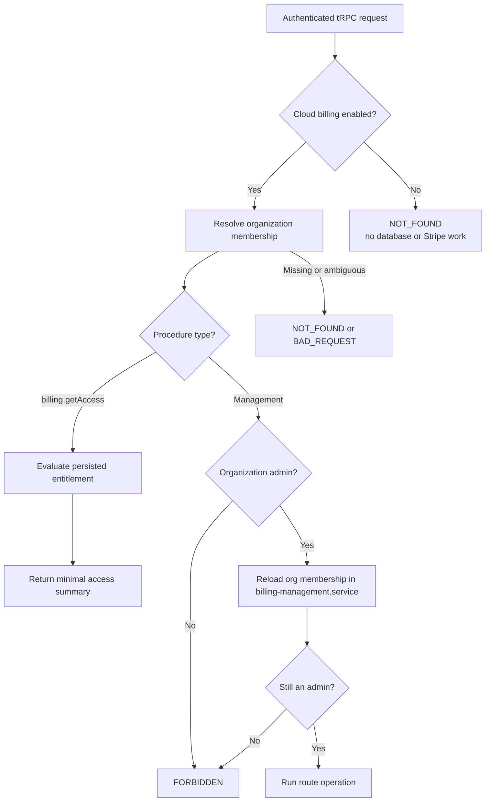

The browser cannot select Stripe object IDs. The management service reloads the organization after checking the authenticated user's current membership, then uses only persisted Customer and Subscription IDs.

### Route map

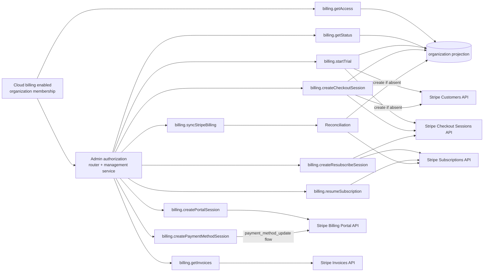

- `billing.getAccess` returns only entitlement, trial, role-action, and billing-action state required by the organization-wide banner.
- `billing.getStatus` returns the persisted plan, entitlement dates, action availability, and payment-method readiness.
- `billing.startTrial` creates or reuses a zero-due Stripe Checkout for the organization's one 14-day trial. Access remains restricted until Stripe confirms the subscription.
- `billing.getInvoices` lists up to 100 invoices for the persisted Customer and returns only display fields and hosted document URLs.
- `billing.syncStripeBilling` retrieves canonical Stripe state and refreshes the local projection.
- `billing.createCheckoutSession` preserves the remaining trial for organizations that activated a local trial before Checkout-backed activation was introduced.
- `billing.createPortalSession` opens the general Customer Portal for an existing subscription.
- `billing.createPaymentMethodSession` opens a Portal flow restricted to payment-method updates.
- `billing.createResubscribeSession` allows a new paid Checkout only after a canceled or incomplete-expired subscription.
- `billing.resumeSubscription` resumes only a paused subscription with a usable default payment method.

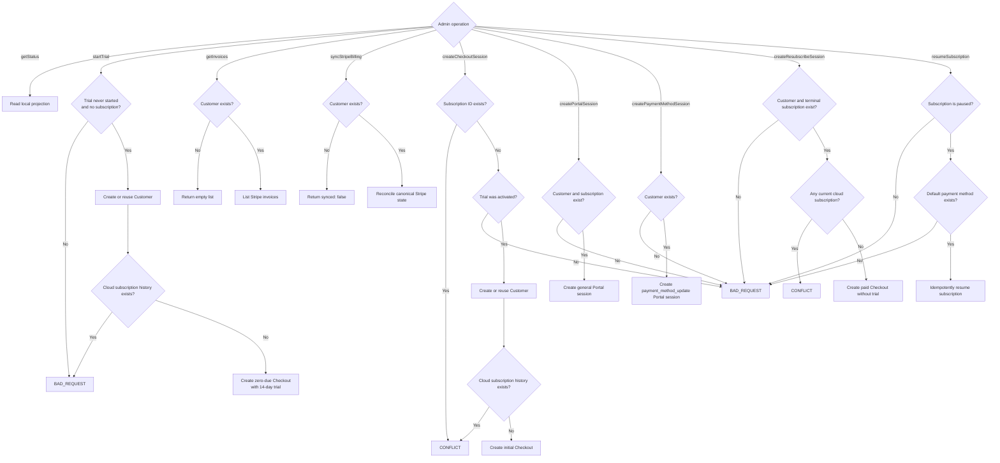

## Trial and subscription lifecycle

### Organization creation

Cloud organization creation does not start a trial or call Stripe. This prevents a personal organization created at signup from consuming its trial when the user later joins another organization.

An organization starts with restricted access. An admin must complete the zero-due Stripe Checkout before the trial begins. Opening or abandoning Checkout does not grant access. Regular members cannot start Checkout, and an organization with subscription history cannot receive another trial.

### Initial Checkout

Checkout:

1. resolves or creates one Stripe Customer for the organization;
2. rejects Customers with existing cloud subscription history;
3. uses the server-selected Price and quantity `1`;
4. configures a 14-day trial with a zero amount due today;
5. allows Checkout to skip payment-method collection while nothing is due;
6. pauses the subscription at trial expiry when no payment method is available;
7. stores the organization and plan keys in server-created metadata;
8. returns only the hosted Checkout URL.

The success redirect is not proof of payment. The UI polls the persisted projection while signed webhook processing or explicit reconciliation confirms Stripe state. While confirmation is pending, the billing page reports that it is checking Stripe. Once the trial subscription is present, the temporary Checkout feedback disappears and the organization access query is invalidated so the global trial banner and chat gate update immediately.

```mermaid
sequenceDiagram
    actor Admin
    participant UI as Billing page
    participant Router as billing.startTrial
    participant Management as Billing management service
    participant DB as Database
    participant Stripe as Stripe API
    participant Webhook as Signed webhook worker

    Admin->>UI: Start free trial
    UI->>Router: Authenticated mutation
    Router->>DB: Resolve membership and require admin
    Router->>Management: userId and organizationId
    Management->>DB: Recheck current admin role and reload organization
    alt Customer does not exist
        Management->>Stripe: Create Customer with org metadata
        Stripe-->>Management: Customer ID
        Management->>DB: Attach Customer if still unassigned
    end
    Management->>Stripe: List cloud subscription history
    alt Existing subscription history
        Stripe-->>Management: Existing subscriptions
        Management-->>Router: Conflict; use recovery or resubscribe
    else First subscription
        Management->>Stripe: Create or reuse 14-day trial Checkout
        Stripe-->>Management: Hosted Checkout URL
        Router-->>UI: URL only
        UI->>Stripe: Navigate to hosted Checkout
        alt Checkout completed
            Stripe-->>UI: Redirect to billing page
            Stripe->>Webhook: Checkout and subscription events
            Webhook->>DB: Reconcile subscription and grant trial access
        else Checkout abandoned
            Note over UI,DB: Organization remains restricted and trial remains available
        end
        UI->>Router: Poll persisted status
    end
```

### Trial expiry

When a Checkout-created trial ends without a payment method, Stripe pauses the subscription. The organization becomes restricted while billing recovery remains available. An admin can add a payment method in the Portal and request an idempotent resume.

### Cancellation and resubscription

Portal cancellation occurs at period end. Access continues until the cancellation boundary. Canceled and incomplete-expired subscriptions remain as history and can start a new paid Checkout without another trial.

Cancellation never removes nao data or Stripe identifiers.

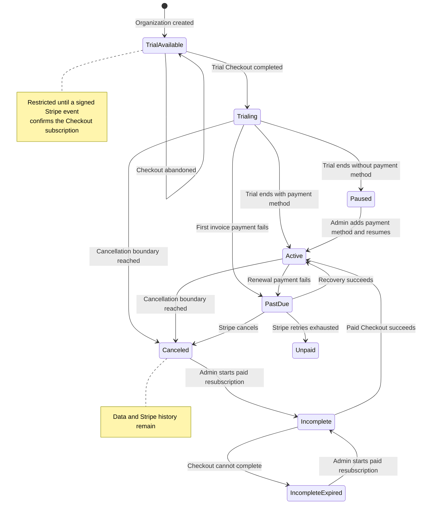

## Reconciliation and webhooks

The raw webhook route:

1. verifies the exact raw body with the endpoint signing secret;
2. rejects invalid signatures and unexpected live-mode events;
3. inserts the Event ID into the durable inbox;
4. acknowledges duplicate Event IDs;
5. enqueues a unique scheduled job;
6. returns promptly without performing Stripe reconciliation inline.

Workers retrieve canonical current Stripe state instead of applying event deltas. Stripe does not guarantee delivery order.

Each reconciliation:

1. resolves the organization by its unique Customer mapping or trusted metadata;
2. claims a random `billingSyncToken`;
3. lists subscriptions for the configured Product;
4. selects the single current subscription or latest terminal history;
5. validates Customer and organization ownership;
6. projects status, Price, trial, period, cancellation, payment-method, and access fields;
7. writes only if the sync token remains current.

This compare-and-swap prevents a slower stale read from overwriting newer state.

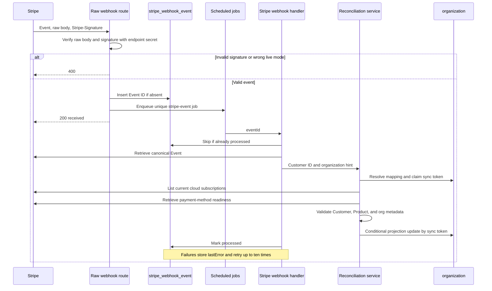

Event types only trigger a refresh category; they do not directly mutate entitlement from their payload:

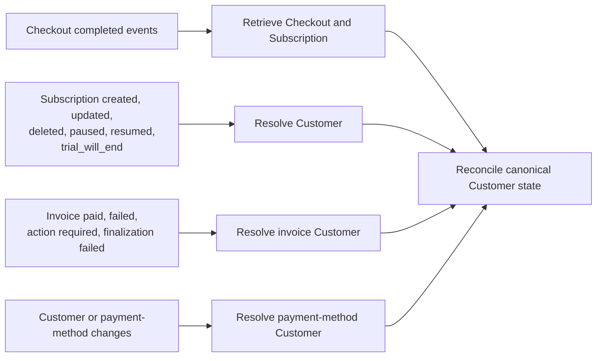

An hourly lifecycle job reconciles every mapped organization in batches of five concurrent Customers. Individual failures are logged without aborting the remaining organizations.

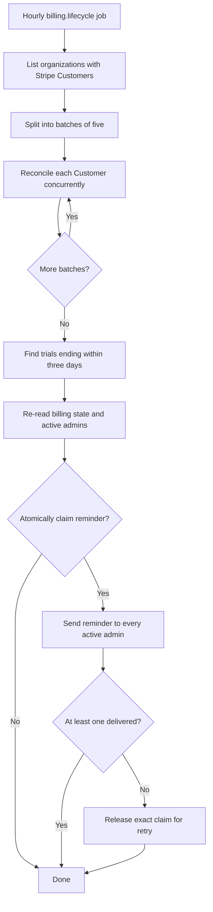

## Entitlement policy

Full access is granted when:

- cloud billing is disabled;
- the deployment is self-hosted;
- a Stripe-confirmed trial has not ended;
- a renewing `active` subscription is within 24 hours after its projected period end;
- an `active` subscription scheduled for cancellation has not reached its access end;
- Stripe reports `past_due` while its configured recovery process remains active.

The 24-hour active grace prevents a renewal webhook delay or short Stripe outage from immediately locking out a paying organization. It is bounded: if webhooks and hourly reconciliation do not advance the period within that window, cost-producing access closes.

Access is restricted for missing or expired trials and for `unpaid`, `paused`, `incomplete`, `incomplete_expired`, or `canceled` subscriptions.

Restricted organizations retain:

- authentication;
- organization and account administration;
- billing status, Checkout, Portal, invoices, and recovery actions;
- authenticated project creation and updates through `/api/deploy`, without agent execution access;
- read-only access to existing projects, conversations, stories, settings, and customer-owned data.

Restrictions block cost-producing execution and protected mutations, including agent/model calls, SQL execution, transcription, live refresh, automation execution, repository import, and context mutations.

Enforcement happens at backend service and route boundaries. UI warnings are not security controls. Background jobs become no-ops while restricted and remain configured for later recovery.

An organization API key may create or update a project through `/api/deploy` before the trial starts. Deployment authenticates the key and scopes the project to its organization, but intentionally does not require billing entitlement. Any scheduled project work checks entitlement before execution and becomes a no-op while access is restricted.

This allows the user to finish project setup before encountering billing:

1. sign up, which creates the personal organization;
2. create an organization API key;
3. deploy the first project;
4. open the project and attempt to talk to the agent;
5. follow the billing prompt and complete the 14-day trial Checkout;
6. talk to the agent after Stripe confirms the trial subscription.

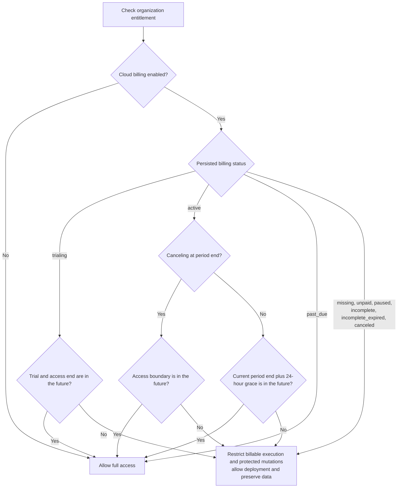

## Cloud agent access enforcement

On nao Cloud, an organization must have an active trial or paid subscription to talk to an agent. User-supplied model API keys do not bypass this requirement: they may cover model usage, but the hosted nao service still incurs infrastructure costs.

Enforcement occurs before agent work is persisted or initialized:

- `/api/agent` checks the resolved chat or selected project before creating or editing chats, storing messages, initializing tools, or calling a model provider;
- messaging integrations, automations, context recommendations, MCP `ask_nao`, forks, tests, and subagents use the same project entitlement guard;
- `agentService.create` keeps an independent assertion so future or non-HTTP callers fail closed;
- lower-level model, transcription, SQL execution, and live-story boundaries retain independent guards;
- restricted requests return `FORBIDDEN`, and the web composer is replaced with an actionable billing prompt;
- existing chats, projects, stories, settings, and customer data remain readable.

Expired or missing trials and `unpaid`, `paused`, `incomplete`, `incomplete_expired`, and `canceled` subscriptions cannot create agent messages, inference records, tool runs, or provider requests. Active trials, entitled subscriptions, self-hosted deployments, and cloud deployments with billing disabled continue normally. User-supplied model API keys never bypass this enforcement.

## Trial reminders

The hourly lifecycle job and Stripe's `trial_will_end` event share one persisted reminder claim.

- Reminders are due three days before trial expiry.
- Billing state and current active admins are re-read before sending.
- A successful delivery to at least one admin consumes the claim.
- If every send fails, the exact claim is released so a later run can retry.
- Concurrent workers cannot claim the same reminder.

## Billing API and UI

The cloud-only billing router provides:

- minimal access and trial state for organization members;
- status for organization admins;
- invoice history for admins;
- explicit Stripe synchronization;
- initial Checkout;
- Customer Portal;
- payment-method management;
- resubscription;
- paused-subscription resume.

Stripe identifiers and raw Stripe objects are never returned to the browser.

All eight management procedures use the shared admin middleware and call a management-service operation that independently reloads the membership and requires `orgMember.role = admin`. This second check protects Stripe access if a future caller reaches the service without the expected route middleware.

The Plan & Billing page displays the plan, trial and paid boundaries, cancellation state, payment-method readiness, invoice history, subscription history, and recovery actions. An organization-wide banner tells a new organization that its trial has not started, warns members three days before trial expiry, and explains restricted access afterward, with a billing action for admins. The new-organization banner disappears as soon as the confirmed trial state refreshes. The UI polls briefly after Checkout and Portal returns while webhooks remain authoritative; confirmation progress remains visible only while Stripe state is pending or delayed.

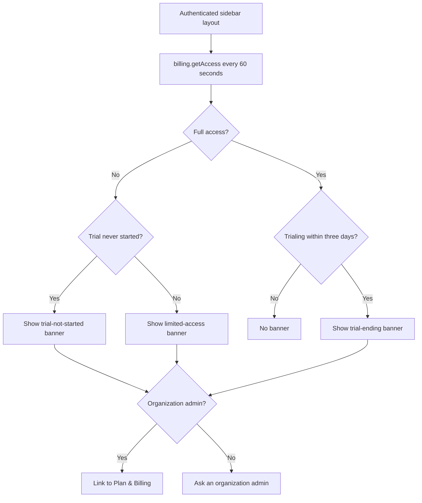

## Deployment and rollback

Deployment order:

1. create a database backup using the environment's normal operational process;
2. verify the target `DB_URI`;
3. apply migration `0065` with `npm run db:migrate -w @nao/backend`;
4. deploy the code while `CLOUD_BILLING_ENABLED=false`;
5. configure and validate the sandbox Product, Price, Portal, emails, retries, and webhook;
6. identify existing organizations that are eligible to activate a trial;
7. enable billing in a non-production cloud environment;
8. run trial activation, renewal, failure, cancellation, replay, and recovery simulations;
9. repeat with live Stripe objects and secrets before gradual production enablement.

Rolling out code before the migration causes missing-column failures. Applying the migration alone does not enable billing.

Rollback disables `CLOUD_BILLING_ENABLED` without deleting billing state, inbox rows, organizations, or Stripe subscriptions.

## Testing

Focused automated tests cover:

- Stripe configuration and Price validation;
- one-time trial Checkout and admin authorization;
- abandoned Checkout remaining restricted until Stripe confirmation;
- project deployment before trial activation while agent execution remains restricted;
- organization selection;
- webhook signatures, deduplication, ordering, and retries;
- reconciliation ownership and stale-write protection;
- bounded reconciliation concurrency;
- reminder claiming, delivery, and retry;
- entitlement boundaries;
- billing routes and every management-service admin boundary.

Sandbox validation should use Stripe CLI forwarding and Billing test clocks:

```bash
stripe listen --forward-to localhost:5005/api/billing/stripe/webhook
```

The sandbox payment-method picker only exposes a few common presets. Enter Stripe's test card numbers manually to cover the relevant billing outcomes:

- `4242 4242 4242 4242`: successful payment;
- `4000 0000 0000 3220`: requires 3D Secure authentication, then succeeds;
- `4000 0000 0000 0002`: `card_declined` with `generic_decline`;
- `4000 0000 0000 9995`: `card_declined` with `insufficient_funds`;
- `4000 0000 0000 9987`: `card_declined` with `lost_card`;
- `4000 0000 0000 9979`: `card_declined` with `stolen_card`;
- `4000 0000 0000 0069`: `expired_card`;
- `4000 0000 0000 0127`: `incorrect_cvc`;
- `4000 0000 0000 0119`: `processing_error`;
- `4242 4242 4242 4241`: `incorrect_number`;
- `4000 0000 0000 6975`: `card_declined` with `card_velocity_exceeded`;
- `4000 0000 0000 0341`: attaches to a Customer successfully, then declines when charged.

Use any future expiry date and any three-digit CVC unless testing invalid input. The incorrect-number card fails client-side validation before Stripe creates a payment attempt, so it does not produce payment-failure webhooks. Most decline cards also cannot be saved to a Customer. To test a recurring subscription failure after a successful attachment, use `4000 0000 0000 0341` as the default payment method and advance a test clock to the next charge.

Exercise cardless trial Checkout, immediate paid Checkout, payment-method updates, trial pause and resume, renewals, failed payments, cancellation and reversal, duplicate events, downtime, and Dashboard edits.

## Known organization, project, and onboarding dependencies

The following issues are outside the Stripe billing implementation and should be handled in a separate organization/onboarding PR. Billing must remain organization-scoped and should consume one unambiguous organization context after these flows are corrected.

### Membership integrity

1. Project and messaging-provider flows can create `project_member` rows without a matching `org_member`. Project APIs then work while organization settings and `billing.getAccess` fail.
2. Organization settings are visible based on project role even when the user has no resolvable organization membership.
3. Removing a direct project membership does not remove access inherited through organization membership, so the removal can appear successful without changing effective access.
4. The project team page lists direct project members but omits users with organization-inherited project access.
5. The generic `Admin` label normally displays the current project role. It does not communicate whether the user is also an organization admin who can manage members and billing.

### Organization selection

6. A user may belong to multiple organizations, but there is no organization picker. With no selected project, organization-scoped requests fail when more than one membership exists.
7. `project.getCurrent` may fall back from a stale or inaccessible selected project while organization and billing routes continue using the raw project header. The displayed project and billing organization can therefore diverge.

### Invitations and consent

8. Adding an existing user immediately creates membership without acceptance. Adding an unknown email creates a credential account, temporary password, and membership.
9. The `invited` member status is derived from `requiresPasswordReset`; there is no pending invitation entity, recipient-bound token, accept or decline action, expiry state, or audit trail.
10. Users cannot leave an organization themselves, so they cannot reject an unwanted membership or remove an unused personal organization after joining another organization.

### Removal and onboarding

11. Removing an effective project admin throws an unstructured error and can target an organization-inherited admin who is absent from the project team list.
12. Cloud signup creates a personal organization and admin membership but no project, leaving project creation or import as a separate onboarding step.
13. Verified-domain auto-join is applied to Google sign-in but not GitHub or GitLab sign-in, so the same work identity can receive different organization membership depending on the provider.

The separate PR should:

- enforce a single project-to-organization membership invariant or explicitly support project-only membership across every organization API;
- introduce expiring invitations with accept and decline actions instead of direct membership creation;
- add self-serve organization departure while protecting the last admin;
- provide an explicit organization selector and one canonical project/organization context;
- show effective project access, including organization-inherited access, and make removal semantics accurate;
- label project and organization roles separately;
- make cloud onboarding behavior consistent across authentication providers.

Product decisions required before implementation:

- whether organization membership grants access to every current and future organization project;
- whether a project role may override or downgrade an organization role;
- whether an unused personal organization is retained, deactivated, or archived after joining another organization;

## Security and operations

- Verify every webhook against the unmodified body.
- Keep Stripe keys server-side and rotate exposed credentials immediately.
- Use idempotency keys for mutating Stripe requests.
- Validate Customer, Subscription, Product, organization metadata, and live mode.
- Never log full Stripe objects, webhook bodies, secrets, card data, billing addresses, or tax IDs.
- Alert on repeated webhook failures, old pending inbox rows, invoice finalization failures, mapping conflicts, unknown Products, Stripe API error spikes, and reconciliation drift.
- Record structured organization, Event, Customer, Subscription, event-type, result, and retry identifiers without customer PII.

Operational recovery must support replaying an inbox event, resending an Event from Stripe Workbench, rotating secrets, correcting a Customer mapping, and disabling enforcement without erasing state.

## Future credit top-ups

Credit top-ups are separate one-time payments:

- use Checkout `mode=payment`;
- select top-up Prices on the server;
- fulfill from signed webhooks;
- record immutable grant and spend entries in a dedicated ledger;
- use idempotency independent from subscription invoices.

Do not add a credit ledger or additional cloud tiers as part of the initial subscription implementation. Stable plan keys and separate payment handling leave room for them later.

## Production decisions

Resolve before launch:

1. whether EUR 2,000 is tax-inclusive or tax-exclusive;
2. whether Stripe Tax is enabled;
3. supported recurring payment methods;
4. Smart Retry duration and whether exhausted subscriptions become `unpaid` or canceled;
5. the exact read-only and export surface after restriction;
6. treatment of existing externally billed organizations;
7. whether support can grant an audited temporary extension;
8. legal invoice fields and cancellation disclosures.

## Stripe references

- [SaaS subscriptions](https://docs.stripe.com/get-started/use-cases/saas-subscriptions)
- [Build subscriptions with Checkout](https://docs.stripe.com/payments/checkout/build-subscriptions)
- [Subscription trials](https://docs.stripe.com/billing/subscriptions/trials)
- [Subscription webhooks and statuses](https://docs.stripe.com/billing/subscriptions/webhooks)
- [Webhook security](https://docs.stripe.com/webhooks)
- [Customer Portal](https://docs.stripe.com/customer-management)
- [Billing simulations and test clocks](https://docs.stripe.com/billing/testing/test-clocks)
- [Smart Retries](https://docs.stripe.com/billing/revenue-recovery/smart-retries)
- [Customer billing emails](https://docs.stripe.com/invoicing/send-email)
- [Idempotent requests](https://docs.stripe.com/api/idempotent_requests)
- [Secret-key best practices](https://docs.stripe.com/keys-best-practices)
