# nao Cloud billing with Stripe

This document describes the architecture, configuration, rollout, and operational rules for organization billing in nao Cloud.

## Product contract

- Billing is owned by an organization, never by a user or cloud instance.
- Every eligible cloud organization receives one 14-day trial.
- The initial plan is EUR 2,000 per month with unlimited users.
- Stripe subscription quantity is always `1`.
- Organization admins can subscribe, manage payment details, view invoices, cancel, and recover a paused subscription.
- Billing restrictions preserve organizations, projects, users, chats, stories, files, and analytics data.
- Self-hosted deployments never construct a Stripe client or enforce cloud billing.
- The instance-wide license system is not a cloud subscription source of truth.

Cloud billing is active only when both conditions are true:

```env
NAO_MODE=cloud
CLOUD_BILLING_ENABLED=true
```

When disabled, billing tRPC procedures return `NOT_FOUND`, raw Stripe routes and billing jobs are not registered, and application access remains unrestricted.

## System map

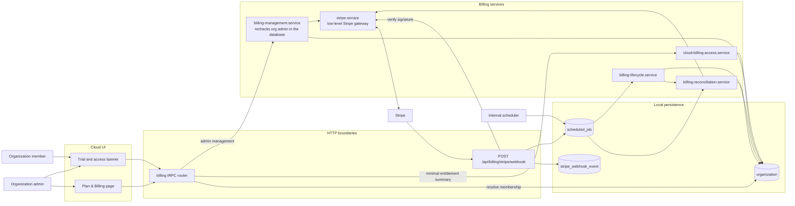

There are two intentional trust paths. Interactive billing-management requests must pass both the tRPC admin middleware and the independent database-backed admin check in `billing-management.service.ts`. The member-readable entitlement summary does not expose Stripe or invoice data. Signed Stripe webhooks and internal scheduled jobs do not impersonate a user; they use the lower-level Stripe gateway and validate object ownership during reconciliation.

## Stripe configuration

### Product and Price

Create one Stripe Product named `nao Cloud` and one recurring Price:

- currency: `EUR`
- unit amount: `200000`
- interval: monthly
- usage type: licensed
- quantity: `1`
- lookup key: `nao_cloud_monthly_v2`

The backend resolves the Price by lookup key and validates the full billing contract before use. The browser never supplies an amount, Price ID, Customer ID, Subscription ID, or organization ID as authoritative billing input.

Create a new Price for future pricing changes. Existing subscriptions can retain their historical Price while reconciliation recognizes the configured Product.

### Customer Portal

Configure the Stripe Customer Portal to:

- update payment methods, billing addresses, and tax IDs as required;
- display and download invoices;
- cancel at the end of the current period;
- preserve an active trial when subscription details are edited;
- return to `/settings/organization/billing`;
- disable plan switching while only one plan exists.

Portal sessions are short-lived and created on every authenticated admin request.

### Billing emails and retries

Stripe owns receipts, invoice documents, failed-payment recovery, payment-action messages, expiring-card notices, and cancellation confirmations. nao owns the product-specific trial-ending reminder.

Configure Smart Retries deliberately. The Stripe retry schedule determines how long a `past_due` organization remains entitled.

### Webhook destination

Register:

```text
POST https://<cloud-domain>/api/billing/stripe/webhook
```

Subscribe to:

- `checkout.session.completed`
- `checkout.session.async_payment_succeeded`
- `checkout.session.async_payment_failed`
- `customer.updated`
- `payment_method.attached`
- `payment_method.detached`
- `payment_method.updated`
- `customer.subscription.created`
- `customer.subscription.updated`
- `customer.subscription.deleted`
- `customer.subscription.paused`
- `customer.subscription.resumed`
- `customer.subscription.trial_will_end`
- `invoice.paid`
- `invoice.payment_failed`
- `invoice.payment_action_required`
- `invoice.finalization_failed`

Pin the destination to the API version used by the Stripe SDK.

## Server configuration

```env
CLOUD_BILLING_ENABLED=false
STRIPE_SECRET_KEY=
STRIPE_CLOUD_MONTHLY_PRICE_LOOKUP_KEY=nao_cloud_monthly_v2
STRIPE_WEBHOOK_SECRET=
STRIPE_PORTAL_CONFIGURATION_ID=
```

`STRIPE_SECRET_KEY`, the Price lookup key, and `STRIPE_WEBHOOK_SECRET` are required when cloud billing is enabled. The portal configuration ID is optional when the Stripe account default is suitable.

Keep sandbox and live credentials separate. Store secrets in the deployment secret manager, never in source control, logs, client bundles, database rows, or analytics.

## Data model

Billing extends the existing `organization` table:

- `billingPlan`
- `billingStatus`
- `trialStartedAt`
- `trialEndsAt`
- `stripeCustomerId`
- `stripeSubscriptionId`
- `stripePriceId`
- `currentPeriodEndsAt`
- `cancelAtPeriodEnd`
- `hasDefaultPaymentMethod`
- `billingAccessEndsAt`
- `billingUpdatedAt`
- `billingSyncToken`
- `trialReminderClaimedAt`

Supported local statuses are `trialing`, `active`, `past_due`, `unpaid`, `canceled`, `paused`, `incomplete`, and `incomplete_expired`.

Stripe Customer and Subscription IDs are unique when present. Trial timestamps are initialized atomically with organization creation and are never reset by Checkout, joining an organization, resubscribing, or renaming the organization.

The `stripe_webhook_event` table is a durable inbox containing the Event ID, type, object ID, live-mode flag, receipt time, processing time, and last error. Raw event payloads and payment details are not retained.

PostgreSQL and SQLite use the same logical migration, `0065_organization_billing`, with synchronized schema snapshots.

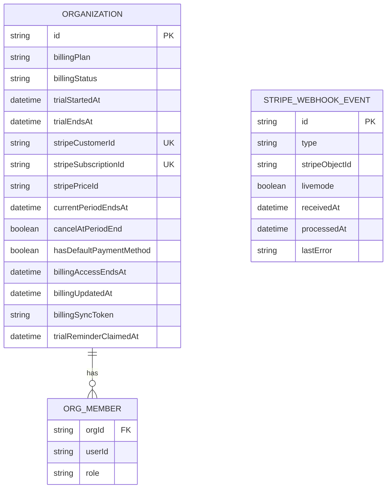

Stripe owns Customers, Subscriptions, Prices, Payment Methods, and Invoices. nao stores identifiers and a queryable projection, not copies of payment data:

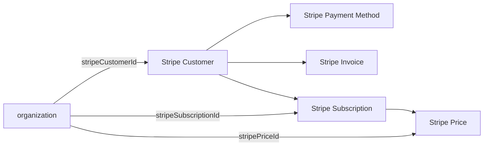

## Organization resolution

Organization-scoped requests resolve the organization from the authenticated user's selected project. Without a selected project, the user must belong to exactly one organization. An unknown selected project or ambiguous membership fails instead of falling back to an arbitrary organization.

This rule applies to billing, organization settings, API keys, and GitHub or GitLab project imports.

## Interactive route authorization

Every billing procedure checks the feature flag and resolves organization membership before database-backed billing work. The member-readable access procedure then evaluates the persisted entitlement without exposing Stripe data. Management procedures continue through both admin checks before any Stripe operation:

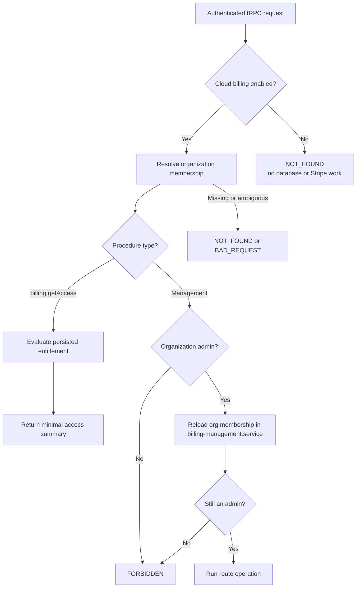

The browser cannot select Stripe object IDs. The management service reloads the organization after checking the authenticated user's current membership, then uses only persisted Customer and Subscription IDs.

### Route map

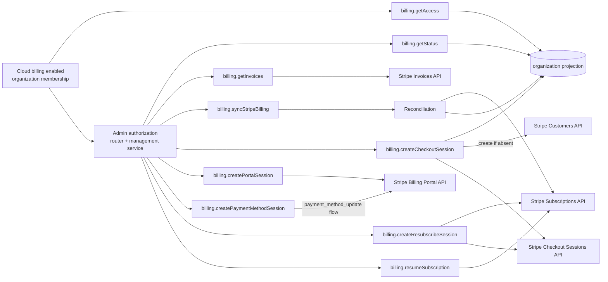

- `billing.getAccess` returns only entitlement, trial, role-action, and billing-action state required by the organization-wide banner.
- `billing.getStatus` returns the persisted plan, entitlement dates, action availability, and payment-method readiness.
- `billing.getInvoices` lists up to 100 invoices for the persisted Customer and returns only display fields and hosted document URLs.
- `billing.syncStripeBilling` retrieves canonical Stripe state and refreshes the local projection.
- `billing.createCheckoutSession` creates or reuses the organization Customer and starts the first subscription Checkout.
- `billing.createPortalSession` opens the general Customer Portal for an existing subscription.
- `billing.createPaymentMethodSession` opens a Portal flow restricted to payment-method updates.
- `billing.createResubscribeSession` allows a new paid Checkout only after a canceled or incomplete-expired subscription.
- `billing.resumeSubscription` resumes only a paused subscription with a usable default payment method.

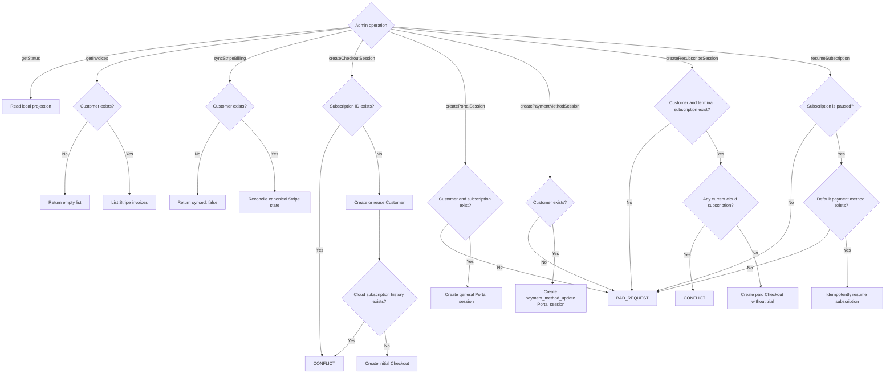

## Trial and subscription lifecycle

### Organization creation

Cloud organization creation stores the plan, trial start, trial end, and access end in the same transaction as the organization. It does not call Stripe.

At the first billing-enabled startup, existing organizations with no plan, trial, or Stripe subscription receive the same one-time 14-day trial. Organizations with billing state are unchanged.

### Initial Checkout

Checkout:

1. resolves or creates one Stripe Customer for the organization;
2. rejects Customers with existing cloud subscription history;
3. uses the server-selected Price and quantity `1`;
4. preserves the local trial with an exact `trial_end` when at least 48 hours remain;
5. otherwise collects a payment method and starts billing immediately;
6. stores the organization and plan keys in server-created metadata;
7. returns only the hosted Checkout URL.

Stripe Checkout requires an absolute trial end to be at least 48 hours in the future. The billing page communicates when less time remains and billing will begin immediately.

The success redirect is not proof of payment. The UI polls the persisted projection while signed webhook processing or explicit reconciliation confirms Stripe state.

```mermaid
sequenceDiagram
    actor Admin
    participant UI as Billing page
    participant Router as billing.createCheckoutSession
    participant Management as Billing management service
    participant DB as Database
    participant Stripe as Stripe API

    Admin->>UI: Subscribe
    UI->>Router: Authenticated mutation
    Router->>DB: Resolve membership and require admin
    Router->>Management: userId and organizationId
    Management->>DB: Recheck current admin role and reload organization
    alt Customer does not exist
        Management->>Stripe: Create Customer with org metadata
        Stripe-->>Management: Customer ID
        Management->>DB: Attach Customer if still unassigned
    end
    Management->>Stripe: List cloud subscription history
    alt Existing subscription history
        Stripe-->>Management: Existing subscriptions
        Management-->>Router: Conflict; use recovery or resubscribe
    else First subscription
        Management->>Stripe: Create or reuse idempotent Checkout Session
        Stripe-->>Management: Hosted Checkout URL
        Router-->>UI: URL only
        UI->>Stripe: Navigate to hosted Checkout
        Stripe-->>UI: Redirect to billing page
        UI->>Router: Poll persisted status
        Note over Stripe,DB: Signed webhooks or explicit reconciliation update the projection
    end
```

### Trial expiry

When a Checkout-created trial ends without a payment method, Stripe pauses the subscription. The organization becomes restricted while billing recovery remains available. An admin can add a payment method in the Portal and request an idempotent resume.

### Cancellation and resubscription

Portal cancellation occurs at period end. Access continues until the cancellation boundary. Canceled and incomplete-expired subscriptions remain as history and can start a new paid Checkout without another trial.

Cancellation never removes nao data or Stripe identifiers.

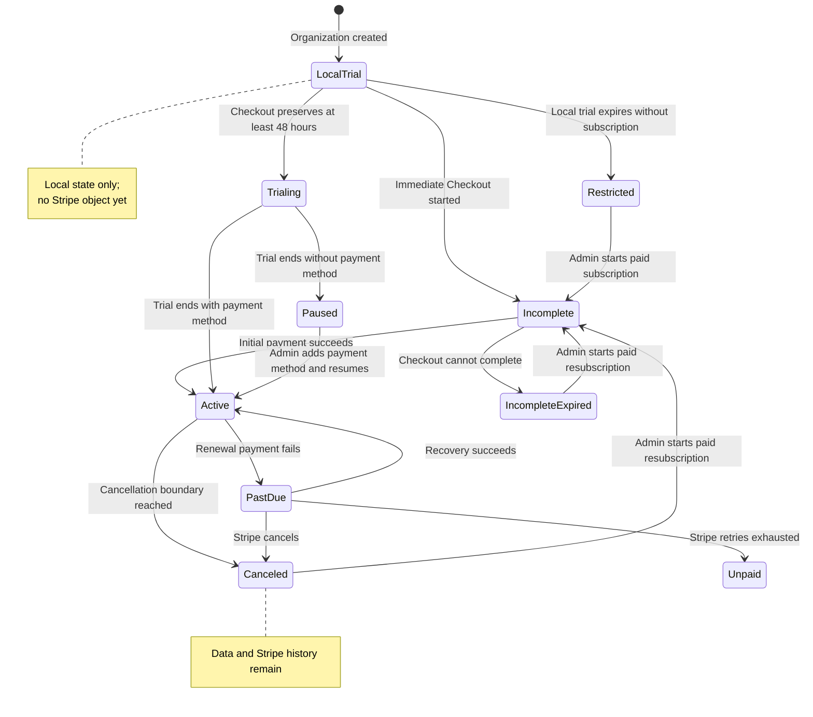

## Reconciliation and webhooks

The raw webhook route:

1. verifies the exact raw body with the endpoint signing secret;
2. rejects invalid signatures and unexpected live-mode events;
3. inserts the Event ID into the durable inbox;
4. acknowledges duplicate Event IDs;
5. enqueues a unique scheduled job;
6. returns promptly without performing Stripe reconciliation inline.

Workers retrieve canonical current Stripe state instead of applying event deltas. Stripe does not guarantee delivery order.

Each reconciliation:

1. resolves the organization by its unique Customer mapping or trusted metadata;
2. claims a random `billingSyncToken`;
3. lists subscriptions for the configured Product;
4. selects the single current subscription or latest terminal history;
5. validates Customer and organization ownership;
6. projects status, Price, trial, period, cancellation, payment-method, and access fields;
7. writes only if the sync token remains current.

This compare-and-swap prevents a slower stale read from overwriting newer state.

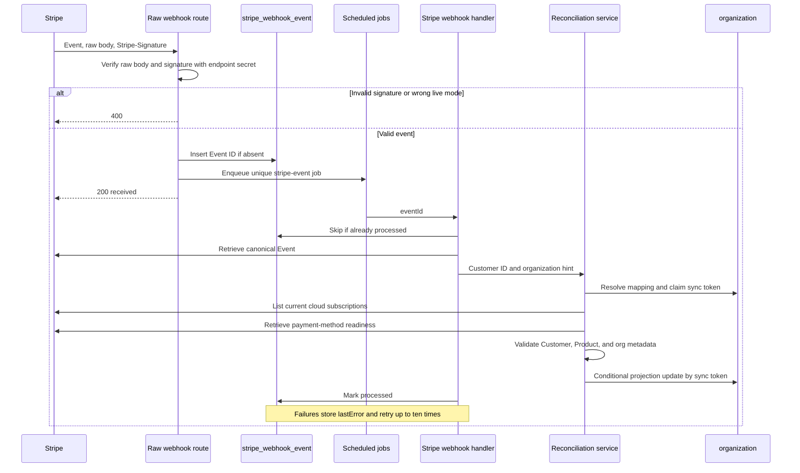

Event types only trigger a refresh category; they do not directly mutate entitlement from their payload:

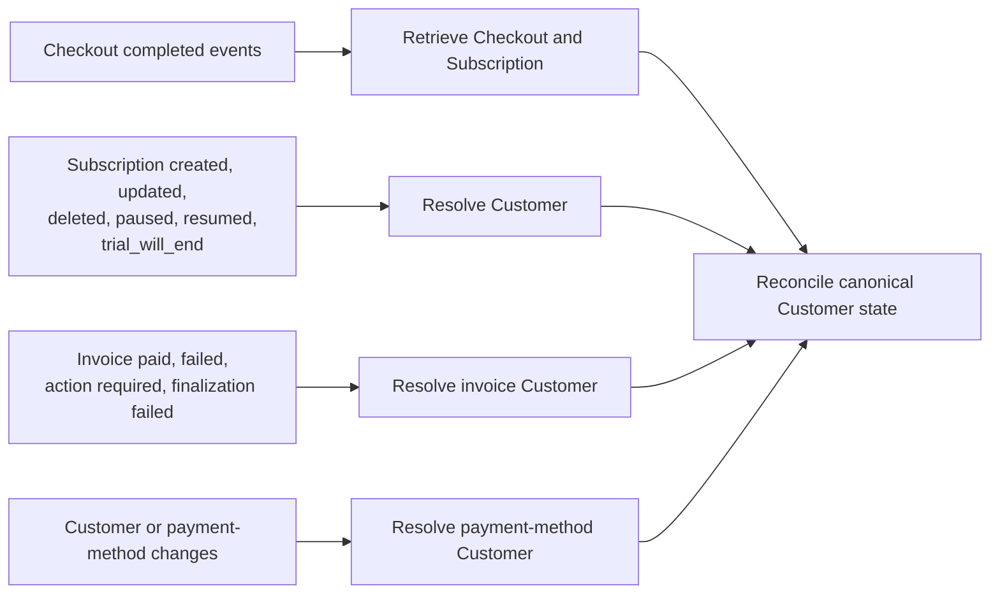

An hourly lifecycle job reconciles every mapped organization in batches of five concurrent Customers. Individual failures are logged without aborting the remaining organizations.

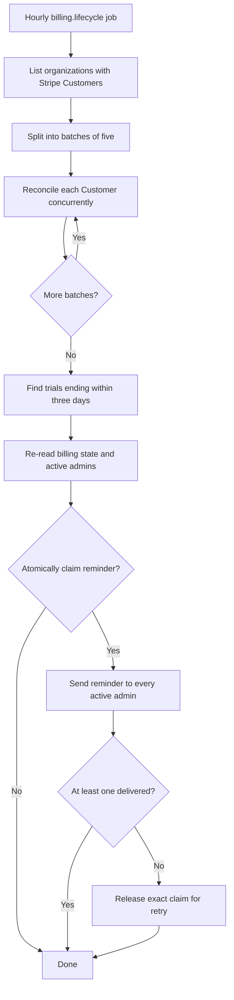

## Entitlement policy

Full access is granted when:

- cloud billing is disabled;
- the deployment is self-hosted;
- a local or Stripe trial has not ended;
- a renewing `active` subscription is within 24 hours after its projected period end;
- an `active` subscription scheduled for cancellation has not reached its access end;
- Stripe reports `past_due` while its configured recovery process remains active.

The 24-hour active grace prevents a renewal webhook delay or short Stripe outage from immediately locking out a paying organization. It is bounded: if webhooks and hourly reconciliation do not advance the period within that window, cost-producing access closes.

Access is restricted for missing or expired trials and for `unpaid`, `paused`, `incomplete`, `incomplete_expired`, or `canceled` subscriptions.

Restricted organizations retain:

- authentication;
- organization and account administration;
- billing status, Checkout, Portal, invoices, and recovery actions;
- read-only access to existing projects, conversations, stories, settings, and customer-owned data.

Restrictions block cost-producing or state-changing work, including agent/model calls, SQL execution, transcription, live refresh, automation execution, deployment, repository import, and context mutations.

Enforcement happens at backend service and route boundaries. UI warnings are not security controls. Background jobs become no-ops while restricted and remain configured for later recovery.

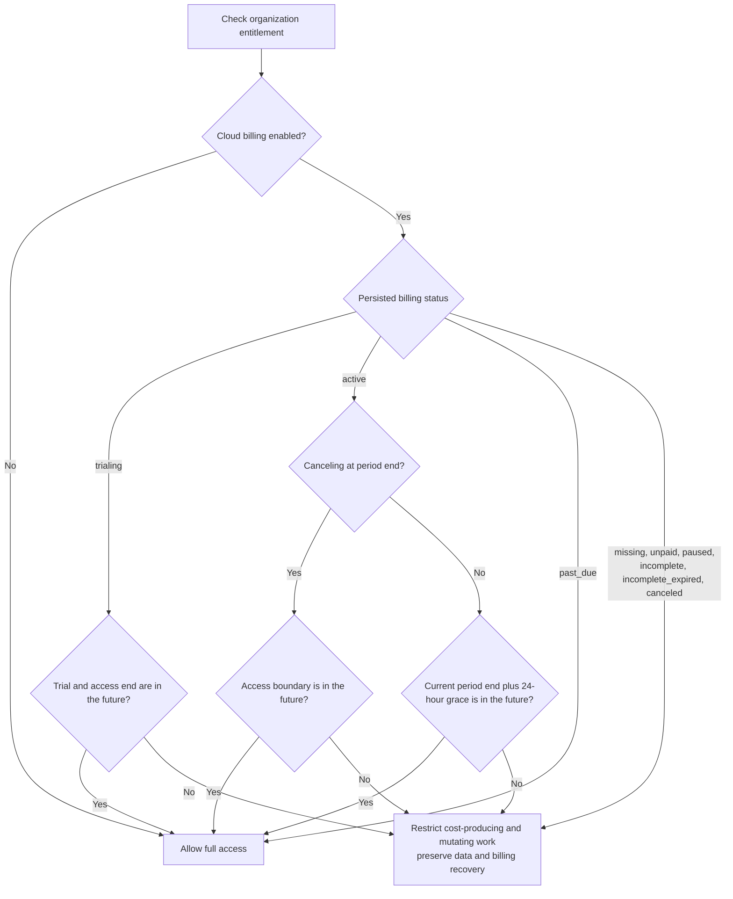

## Trial reminders

The hourly lifecycle job and Stripe's `trial_will_end` event share one persisted reminder claim.

- Reminders are due three days before trial expiry.
- Billing state and current active admins are re-read before sending.
- A successful delivery to at least one admin consumes the claim.
- If every send fails, the exact claim is released so a later run can retry.
- Concurrent workers cannot claim the same reminder.

## Billing API and UI

The cloud-only billing router provides:

- minimal access and trial state for organization members;
- status for organization admins;
- invoice history for admins;
- explicit Stripe synchronization;
- initial Checkout;
- Customer Portal;
- payment-method management;
- resubscription;
- paused-subscription resume.

Stripe identifiers and raw Stripe objects are never returned to the browser.

All eight management procedures use the shared admin middleware and call a management-service operation that independently reloads the membership and requires `orgMember.role = admin`. This second check protects Stripe access if a future caller reaches the service without the expected route middleware.

The Plan & Billing page displays the plan, trial and paid boundaries, cancellation state, payment-method readiness, invoice history, subscription history, and recovery actions. An organization-wide banner warns members three days before trial expiry and explains restricted access afterward, with a billing action for admins. The UI polls briefly after Checkout and Portal returns while webhooks remain authoritative.

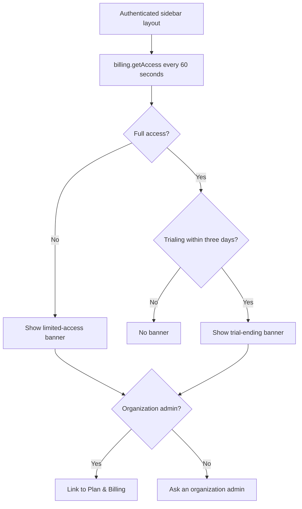

## Deployment and rollback

Deployment order:

1. create a database backup using the environment's normal operational process;
2. verify the target `DB_URI`;
3. apply migration `0065` with `npm run db:migrate -w @nao/backend`;
4. deploy the code while `CLOUD_BILLING_ENABLED=false`;
5. configure and validate the sandbox Product, Price, Portal, emails, retries, and webhook;
6. identify existing organizations that must not receive the automatic trial;
7. enable billing in a non-production cloud environment;
8. run trial, renewal, failure, cancellation, replay, and recovery simulations;
9. repeat with live Stripe objects and secrets before gradual production enablement.

Rolling out code before the migration causes missing-column failures. Applying the migration alone does not enable billing.

Rollback disables `CLOUD_BILLING_ENABLED` without deleting billing state, inbox rows, organizations, or Stripe subscriptions.

## Testing

Focused automated tests cover:

- Stripe configuration and Price validation;
- one-time trial initialization;
- Checkout trial boundaries, including Stripe's 48-hour minimum;
- organization selection;
- webhook signatures, deduplication, ordering, and retries;
- reconciliation ownership and stale-write protection;
- bounded reconciliation concurrency;
- reminder claiming, delivery, and retry;
- entitlement boundaries;
- billing routes and every management-service admin boundary.

Sandbox validation should use Stripe CLI forwarding and Billing test clocks:

```bash
stripe listen --forward-to localhost:5005/api/billing/stripe/webhook
```

Exercise cardless trial Checkout, immediate paid Checkout, payment-method updates, trial pause and resume, renewals, failed payments, cancellation and reversal, duplicate events, downtime, and Dashboard edits.

## Security and operations

- Verify every webhook against the unmodified body.
- Keep Stripe keys server-side and rotate exposed credentials immediately.
- Use idempotency keys for mutating Stripe requests.
- Validate Customer, Subscription, Product, organization metadata, and live mode.
- Never log full Stripe objects, webhook bodies, secrets, card data, billing addresses, or tax IDs.
- Alert on repeated webhook failures, old pending inbox rows, invoice finalization failures, mapping conflicts, unknown Products, Stripe API error spikes, and reconciliation drift.
- Record structured organization, Event, Customer, Subscription, event-type, result, and retry identifiers without customer PII.

Operational recovery must support replaying an inbox event, resending an Event from Stripe Workbench, rotating secrets, correcting a Customer mapping, and disabling enforcement without erasing state.

## Future credit top-ups

Credit top-ups are separate one-time payments:

- use Checkout `mode=payment`;
- select top-up Prices on the server;
- fulfill from signed webhooks;
- record immutable grant and spend entries in a dedicated ledger;
- use idempotency independent from subscription invoices.

Do not add a credit ledger or additional cloud tiers as part of the initial subscription implementation. Stable plan keys and separate payment handling leave room for them later.

## Production decisions

Resolve before launch:

1. whether EUR 2,000 is tax-inclusive or tax-exclusive;
2. whether Stripe Tax is enabled;
3. supported recurring payment methods;
4. Smart Retry duration and whether exhausted subscriptions become `unpaid` or canceled;
5. the exact read-only and export surface after restriction;
6. treatment of existing externally billed organizations;
7. whether support can grant an audited temporary extension;
8. legal invoice fields and cancellation disclosures.

## Stripe references

- [SaaS subscriptions](https://docs.stripe.com/get-started/use-cases/saas-subscriptions)
- [Build subscriptions with Checkout](https://docs.stripe.com/payments/checkout/build-subscriptions)
- [Subscription trials](https://docs.stripe.com/billing/subscriptions/trials)
- [Subscription webhooks and statuses](https://docs.stripe.com/billing/subscriptions/webhooks)
- [Webhook security](https://docs.stripe.com/webhooks)
- [Customer Portal](https://docs.stripe.com/customer-management)
- [Billing simulations and test clocks](https://docs.stripe.com/billing/testing/test-clocks)
- [Smart Retries](https://docs.stripe.com/billing/revenue-recovery/smart-retries)
- [Customer billing emails](https://docs.stripe.com/invoicing/send-email)
- [Idempotent requests](https://docs.stripe.com/api/idempotent_requests)
- [Secret-key best practices](https://docs.stripe.com/keys-best-practices)
