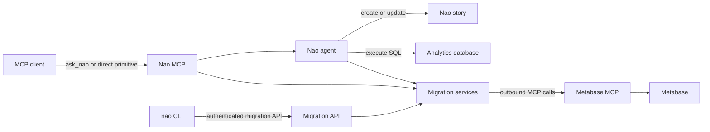

# Metabase dashboard migration plan

Source: [getnao/nao#1636](https://github.com/getnao/nao/issues/1636)

## Goal

A user can point an agent at a Metabase collection or dashboard and receive an equivalent nao story, then continue iterating with the agent until the structure, visualizations, and numbers are acceptably faithful.

The complete feature has two deliverables:

1. Structured primitives available from both the nao CLI and nao MCP for reading Metabase assets and writing nao assets.
2. An agent migration skill that applies the object mapping, verifies the result, reports unsupported behavior, and updates the story during follow-up requests.

The first usable milestone remains deliberately narrow: one dashboard containing parameterless native-SQL KPI, line, bar, and table cards. Later milestones expand the same path until every requirement in issue #1636 is covered.

## Completion criteria

The issue is complete only when all of the following are true:

- A configured Metabase instance can be inspected through structured nao CLI commands.
- The same source operations are exposed as structured nao MCP tools.
- Collections, dashboards, dashboard tabs, cards, queries, visualization settings, parameters, and filter wiring can be read without relying on model interpretation of an HTML page.
- Native SQL is transferred and executed through nao.
- GUI-built Metabase queries are compiled by Metabase and then executed through nao; the agent never invents replacement SQL from scratch.
- nao stories, story folders, tabs, charts, tables, maps, filters, queries, and revisions can be created or updated through CLI and MCP primitives.
- The migration skill can perform the end-to-end workflow through nao's existing `ask_nao` MCP entrypoint.
- Collections map to story folders, dashboards to stories, and dashboard tabs to story tabs.
- Supported visualizations and formatting are translated according to a documented mapping.
- Dashboard filters preserve their wiring to the cards they control.
- Models, metrics, and segments preserve their executable meaning and are promoted to reusable nao context when a safe equivalent exists.
- Unsupported or lossy mappings produce a partial story plus a precise migration report; they do not disappear silently.
- Representative fixtures cover native SQL, MBQL, filters, models, metrics, segments, text, tabs, layout, and unsupported interactions.
- Reproduction checks show the same underlying numbers in Metabase and nao.
- Live synchronization, pixel-identical rendering, permissions, subscriptions, alerts, and user/group migration remain out of scope.

## Architecture

nao already acts in both MCP directions:

- Outbound: the nao agent connects to external servers from `agent/mcps/mcp.json` through [`apps/backend/src/services/mcp.ts`](../../apps/backend/src/services/mcp.ts).
- Inbound: external clients call nao's `/mcp` endpoint and its existing `ask_nao`, query, chart, and story tools.

The implementation should reuse both directions:

The migration service is the shared boundary:

- MCP tools and authenticated HTTP routes are thin wrappers around the same service functions.
- Python CLI commands call the authenticated HTTP routes using the existing stored-session mechanism in [`cli/nao_core/auth.py`](../../cli/nao_core/auth.py).
- Source reads continue to use the configured Metabase MCP. Do not add a second independent Metabase client unless a required operation cannot be obtained through MCP.
- The skill carries translation judgment. Do not add a deterministic all-in-one migration endpoint that duplicates the agent.

## Existing capabilities to reuse

- Metabase MCP configuration template: [`cli/nao_core/config/mcp/template.py`](../../cli/nao_core/config/mcp/template.py).
- Outbound MCP discovery and calls: [`apps/backend/src/services/mcp.ts`](../../apps/backend/src/services/mcp.ts).
- Inbound `ask_nao`: [`apps/backend/src/mcp/tools/sub-agent.ts`](../../apps/backend/src/mcp/tools/sub-agent.ts).
- nao MCP `execute_sql`, `create_story`, and `update_story`: [`apps/backend/src/mcp/tools/context-layer.ts`](../../apps/backend/src/mcp/tools/context-layer.ts).
- nao MCP chart and story asset tools: [`apps/backend/src/mcp/tools/asset-tools.ts`](../../apps/backend/src/mcp/tools/asset-tools.ts).
- Agent `execute_sql`, `display_chart`, and `story` tools under [`apps/backend/src/agents/tools/`](../../apps/backend/src/agents/tools/).
- Story block builders: [`apps/shared/src/chart-block.ts`](../../apps/shared/src/chart-block.ts).
- Story parsing and validation: [`apps/shared/src/story-segments.ts`](../../apps/shared/src/story-segments.ts) and [`apps/shared/src/story-validation.ts`](../../apps/shared/src/story-validation.ts).
- Story folder queries and permissions: [`apps/backend/src/queries/story-folder.queries.ts`](../../apps/backend/src/queries/story-folder.queries.ts) and [`apps/backend/src/trpc/story-folder.routes.ts`](../../apps/backend/src/trpc/story-folder.routes.ts).
- CLI session authentication: [`cli/nao_core/auth.py`](../../cli/nao_core/auth.py).

Stories live in the nao application database, not in the context filesystem. The CLI must therefore call a running authenticated nao backend for target operations; it must not invent local story files.

## Design rules

- Read the complete source dashboard before creating the target.
- Keep Metabase source access read-only.
- Use Metabase-generated SQL for MBQL, models, metrics, and segments.
- Execute migrated SQL through nao so every rendered block has a valid nao `query_id`.
- Reuse existing chart and story builders instead of serializing tags in a second implementation.
- Keep raw Metabase IDs and names in command results and migration reports.
- Require an explicit database mapping when it is not unambiguous.
- Do not create a migration-tracking database table for a one-time import. Return the created story ID; subsequent updates take that ID explicitly or retain it in the `ask_nao` chat.
- Create the supported portion of a dashboard even when some items cannot migrate.
- Never silently drop an object or behavior.
- Avoid a new dependency unless the existing runtime and standard libraries cannot perform the operation.

## Structured contracts

Add normalized schemas under [`apps/shared/src/metabase-migration.ts`](../../apps/shared/src/metabase-migration.ts). Keep the contracts small enough to reflect observed Metabase payloads while preserving raw IDs and optional source metadata.

### Source objects

- `MetabaseCollection`
    - `id`, `name`, `description`, `parentId`, `archived`.
- `MetabaseDashboard`
    - `id`, `name`, `description`, `collectionId`, ordered tabs, ordered cards, parameters.
- `MetabaseDashboardTab`
    - `id`, `name`, `position`.
- `MetabaseDashboardCard`
    - dashboard-card ID, card/question ID, tab ID, title, description, row, column, width, height, parameter mappings, card definition.
- `MetabaseCard`
    - `id`, `name`, `description`, `databaseId`, `type`, `display`, `datasetQuery`, visualization settings, parameters, source model/metric/segment references.
- `MetabaseExecutableQuery`
    - source type (`native` or `mbql`), database ID, native SQL when present, compiled SQL when requested, template parameters, result metadata.
- `MetabaseParameterMapping`
    - dashboard parameter ID, target card ID, target field/template tag, parameter type, defaults, required state.

### Migration objects

- `DatabaseMapping`
    - Metabase database ID/name to nao `database_id`.
- `MigrationPlan`
    - source dashboard identity, target story/folder identity, normalized cards, planned mappings, unsupported items, required clarifications.
- `MigrationReport`
    - status (`complete`, `partial`, or `failed`), source dashboard, target story, imported items, skipped items with reasons, approximations, verification results, warnings.
- `VerificationResult`
    - source card ID, target query ID, compared columns, row count, comparison mode, match state, mismatch summary.

Validate all MCP, HTTP, and CLI inputs at their trust boundaries. Keep normalized contracts versioned if later payload changes would otherwise be ambiguous.

## Object mapping specification

### Collections and folders

- A Metabase collection becomes a nao story folder.
- Preserve collection nesting when the caller migrates a collection tree.
- Reuse an explicitly selected existing folder; otherwise create folders by source path.
- Personal or inaccessible collections are reported rather than guessed.
- Archived collections and dashboards are excluded by default and available only with an explicit include flag.

### Dashboards and stories

- One Metabase dashboard becomes one nao story.
- Use the dashboard name and description for the initial story title and introduction.
- First migration creates a story and returns its ID.
- Iteration updates that explicit story ID. Do not find a target only by title when duplicate titles are possible.

### Dashboard tabs

- A multi-tab dashboard becomes a story containing only consecutive `<tab>` blocks.
- Preserve source tab order.
- A dashboard with no tabs remains a flowing story.
- Content must never appear outside `<tab>` blocks in a tabbed story.

### Layout

- Sort cards by tab, row, then column.
- Cards sharing a source row become a nao `<grid>` when there are two to four compatible items.
- Derive simple relative widths from Metabase card widths.
- Split rows that exceed nao grid limits.
- Preserve reading order over pixel geometry.
- Record materially lossy layout decisions in the report.

### Native-SQL cards

- Copy parameterless native SQL as the first supported query type.
- Run it through nao `execute_sql` against the mapped database.
- Build tables/charts from the nao result and its query ID.
- Preserve template tags only after filter/template support is implemented.
- Reject write statements at the existing nao SQL trust boundary.

### GUI-built cards and MBQL

- Ask Metabase to compile the saved question to native SQL.
- Prefer compiled SQL returned by the Metabase MCP execution/read operation.
- Never ask the model to recreate the query from visualization labels.
- Preserve the original MBQL in the normalized source object for traceability.
- If the current external MCP package does not expose compiled SQL, add that capability in `getnao/nao-mcp-servers`, release it, and pin the fixture to the first compatible version before implementing the nao mapping.

### Models

- Preserve execution first by compiling model-backed cards to SQL through Metabase.
- When the model resolves to a stable physical table/view, reference the existing nao context table.
- When it is a reusable SQL model without a physical equivalent, offer a reviewed context definition or CTE rather than silently duplicating opaque SQL across cards.
- Report whether the result was reused, inlined, or left unsupported.

### Metrics

- Preserve the metric's numeric behavior through Metabase-compiled SQL.
- If the project has an equivalent nao semantic metric, map to it.
- Otherwise produce a proposed semantic definition for review; do not silently create a business metric from inferred labels.
- Verify metric values over representative filter/date combinations.

### Segments

- Preserve segment behavior through compiled predicates.
- Reuse an existing nao semantic/filter definition when equivalent.
- Otherwise inline the compiled predicate and report that reuse semantics were lost.

### Text and heading cards

- Convert text cards to markdown.
- Preserve headings and links where nao markdown supports them.
- Sanitize unsupported HTML and report removed interactive content.

### Dashboard filters

- Convert each supported dashboard parameter to one nao `<filter>` definition.
- Preserve one-to-many wiring: only queries controlled by the Metabase parameter receive the corresponding nao SQL template block.
- Map defaults and required/optional behavior where nao supports them.
- Do not apply one dashboard filter globally when Metabase only wires it to selected cards.
- Report unsupported parameter types, field filters, and defaults.
- Gate filter migration on the nao story-filter feature being enabled; otherwise create the unfiltered story and report the limitation.

The current implementation supports only optional string equality parameters with an unambiguous native-SQL
template tag. Date-range parameters remain in the fixture as an unsupported acceptance case; migrations remove
their optional Metabase clause, leave the affected card unfiltered, and report the skipped wiring as partial.

### Visualization mapping

Start with direct mappings:

- Metabase scalar to nao `kpi_card`.
- Line to `line`.
- Bar to `bar`, `stacked_bar`, or `horizontal_bar` according to observed settings.
- Area to `area` or `stacked_area`.
- Pie to `pie`; donut to `donut`.
- Combo to `mixed`.
- Scatter to `scatter`.
- Table to `<table>`.
- Map to the closest nao map type when the result includes usable geographic keys or coordinates.

Translate when supported:

- Axis keys and types.
- Series keys, labels, colors, and mixed-chart axis assignment.
- Currency, percent, prefix/suffix, decimal precision, and compact formatting.
- Stacking and 100-percent normalization.
- Data-label visibility.
- Table column formatting and supported conditional formatting.
- KPI comparison behavior when the query returns compatible periods.

Fallback policy:

- Pivot tables may become a flat table only when values remain understandable; otherwise skip.
- Funnel, gauge, progress, sankey, and other unsupported types require an explicit approximation chosen by the skill or a skipped-item report.
- Drill-through, click behavior, dashboard navigation, and custom JavaScript are not reproduced in the initial complete feature and must be reported.

## CLI surface

Add Cyclopts command groups rather than overloading the existing configuration migration command:

- `nao metabase collections`
- `nao metabase dashboards [--collection-id ...]`
- `nao metabase dashboard <id-or-name>`
- `nao metabase card <id>`
- `nao metabase compile-card <id> [--parameters ...]`
- `nao metabase execute-card <id> [--parameters ...]`
- `nao stories folders`
- `nao stories create-folder <name> [--parent-id ...]`
- `nao stories create --title ... --content-file ... [--folder-id ...]`
- `nao stories update <story-id> [--title ...] [--content-file ...]`
- `nao stories move <story-id> [--folder-id ...]`

Behavior:

- Default backend URL comes from `BACKEND_URL`, matching existing CLI test behavior.
- Reuse stored session cookies and login retry from [`cli/nao_core/auth.py`](../../cli/nao_core/auth.py).
- Support JSON output for agents and concise human output by default.
- Commands return stable IDs needed by the next primitive.
- Source commands call the backend facade; they do not duplicate MCP process management in Python.
- Target commands operate on the authenticated user's current project.
- CLI tests mock HTTP responses and assert request/response shape, auth retry, errors, and JSON output.

## MCP surface

Keep `ask_nao` as the recommended migration entrypoint, but also expose the direct primitives required by issue #1636:

- `list_metabase_collections`
- `list_metabase_dashboards`
- `get_metabase_dashboard`
- `get_metabase_card`
- `compile_metabase_card_query`
- `execute_metabase_card`
- `list_story_folders`
- `create_story_folder`
- `move_story_to_folder`

Reuse existing tools instead of duplicating:

- `execute_sql`
- `display_chart`
- `display_map`
- `create_story`
- `update_story`
- `get_story`
- `list_stories`

Requirements:

- Return normalized structured content, not only prose.
- Accept an optional Metabase server name; resolve it automatically only when exactly one compatible server is configured.
- Respect project MCP server/tool enablement.
- Apply existing user/project ownership checks to story and folder operations.
- Source tools remain read-only against Metabase.
- Errors identify whether configuration, authentication, database mapping, source access, or unsupported payload caused the failure.

## Authenticated backend facade

Add a small session-authenticated route group, for example [`apps/backend/src/routes/metabase-migration.ts`](../../apps/backend/src/routes/metabase-migration.ts), registered under `/api/dashboard-migration`.

The route handlers:

- Use `authMiddleware`.
- Resolve the current user and project.
- Call the same migration source/target services used by MCP tools.
- Expose only the operations needed by the CLI.
- Validate bodies and parameters with the shared schemas.
- Never accept arbitrary MCP server commands or arbitrary database writes.

Do not put mapping judgment in these routes.

## Migration skill

Add a built-in skill at [`apps/backend/src/agents/skills/metabase-dashboard-migration.skill.tsx`](../../apps/backend/src/agents/skills/metabase-dashboard-migration.skill.tsx) and register it in [`apps/backend/src/agents/skills/index.ts`](../../apps/backend/src/agents/skills/index.ts).

The skill procedure:

1. Confirm the Metabase MCP is configured and connected.
2. Resolve the requested dashboard from a URL, ID, or unambiguous name.
3. Read its collection, tabs, cards, queries, visualization settings, parameters, and wiring.
4. Read all referenced models, metrics, and segments before choosing mappings.
5. Resolve Metabase-to-nao database mappings; ask one focused clarification if ambiguous.
6. Produce an internal migration plan listing direct mappings, approximations, unsupported items, and required feature flags.
7. Create/reuse the collection-derived story folder.
8. Compile MBQL and reusable objects through Metabase.
9. Execute target SQL through nao and retain every query ID.
10. Build visualization blocks through existing nao tools.
11. Assemble flowing or tabbed story markdown according to the source.
12. Validate the full story.
13. Create the story, or update an explicitly supplied prior story.
14. Execute source cards and compare their results with nao query results.
15. Correct query or mapping errors and re-verify.
16. Return the story link and migration report.

The skill must not:

- Write back to Metabase.
- Guess missing SQL.
- Claim visual or numeric equivalence without verification.
- Duplicate a story when the user asked to iterate.
- Hide skipped objects.

## Fixture environment

### Compose stack

Add [`docker-compose.metabase.yml`](../../docker-compose.metabase.yml) with:

- Metabase pinned to a tested version.
- A dedicated PostgreSQL application database for Metabase.
- A separate seeded PostgreSQL analytics database.
- Health checks and health-gated dependencies.
- Named volumes for Metabase and analytics persistence.
- Metabase at `http://localhost:3001`.
- Analytics PostgreSQL at host port `5434` for the host-run nao backend; Metabase uses the Compose service hostname internally.

Do not modify the production [`docker-compose.yml`](../../docker-compose.yml), and do not expand this feature into repairing the unrelated missing `docker-compose.postgres.yml`.

### Analytics data

Add deterministic ecommerce data under [`docker/metabase/`](../../docker/metabase/) with:

- Customers.
- Products and categories.
- Orders and order items.
- Dates spanning enough periods for trends and period comparisons.
- Status, region, and category values for filters and segments.
- Coordinates or regions for one map fixture.
- Known row counts and aggregate values used as verification oracles.

### Metabase bootstrap

Add an idempotent Node script using built-in `fetch` that:

- Completes local Metabase setup.
- Connects the analytics database.
- Creates nested collections.
- Creates all questions, models, metrics, and segments required by fixtures.
- Creates dashboards, tabs, text cards, card positions, filters, and parameter mappings.
- Locates objects by stable fixture names rather than generated IDs.
- Generates or explains generation of the local API key without committing it.
- Can run twice without duplicating assets.

Pin `@getnao/metabase-mcp-server` to the version tested by the fixture instead of using `latest`.

### Fixture dashboards

Create at least these independent dashboards:

1. Native SQL basics
    - KPI total revenue.
    - Monthly line trend.
    - Revenue by category bar chart.
    - Top customers table.
    - Text heading.
    - One unsupported visualization.
2. Layout and tabs
    - Multiple tabs.
    - Several source rows and widths.
    - Text mixed with visual cards.
3. Filters and templates
    - Date range wired to several cards.
    - Category filter wired to only a subset.
    - Required and optional parameters.
    - Native SQL template tags.
4. GUI query and reusable objects
    - MBQL question.
    - Model-backed question.
    - Metric-backed card.
    - Segment-backed card.
5. Visualization breadth
    - Pie/donut.
    - Area/stacked chart.
    - Combo chart.
    - Scatter.
    - Map.
    - Formatting and conditional-formatting examples.

### nao fixture context

Add an isolated project under [`docker/metabase/context/`](../../docker/metabase/context/) with:

- `nao_config.yaml` connected to analytics PostgreSQL.
- `RULES.md` containing only the fixture's real business definitions.
- `agent/mcps/mcp.json` configured for the pinned Metabase MCP package.
- Environment references for credentials.
- Ignore rules for generated MCP tool specifications while retaining `mcp.json`.

Do not make the normal [`example/nao_config.yaml`](../../example/nao_config.yaml) depend on the Docker fixture.

## Incremental implementation milestones

Each milestone should leave a runnable checkpoint. A later milestone may refine an earlier contract, but it must not remove the earlier end-to-end path.

### Milestone 0: Lock the observable contracts

Work:

- Start a temporary Metabase instance manually if necessary.
- Capture actual JSON for collections, dashboards, tabs, native cards, MBQL cards, visualization settings, parameters, and execution results.
- Confirm whether the Metabase MCP returns compiled SQL in its current package version.
- Write sanitized source payload fixtures for unit tests.
- Finalize normalized shared schemas and exact CLI/MCP names.

Exit check:

- Every required source concept has an observed payload and a normalized representation.
- Any required change to `getnao/nao-mcp-servers` is identified before nao-side implementation.

Observed against Metabase `v0.63.16` and `@getnao/metabase-mcp-server@1.2.4`:

- Question execution retains `data.native_form.query`, so Metabase-compiled MBQL SQL can be normalized without model reconstruction.
- Collection JSON retains `location` rather than `parent_id`; the normalized parent ID is the last numeric segment of that path.
- The package's JSON formatter removes top-level `visualization_settings` and `result_metadata` from `metabase-get-question`. Dashboard reads retain those fields on nested cards because filtering is shallow. Full standalone card fidelity therefore requires an upstream unfiltered card-read response before the complete issue can close.

### Milestone 1: Start healthy databases

Work:

- Add the two PostgreSQL services, health checks, volumes, and analytics host port.

Exit check:

- Compose validates.
- Both databases become healthy.
- Stop/start preserves data.
- Reset removes it.

### Milestone 2: Seed analytics data

Work:

- Add schema, deterministic rows, and oracle queries.

Exit check:

- Exact row counts and known aggregates match after a clean reset.

### Milestone 3: Start persistent Metabase

Work:

- Add pinned Metabase service.
- Add `metabase:start`, `metabase:stop`, and destructive `metabase:reset` scripts to [`package.json`](../../package.json).
- Add non-secret placeholders to [`.env.example`](../../.env.example).

Exit check:

- `/api/health` succeeds before and after restart.
- Metabase application state persists without volume deletion.

### Milestone 4: Bootstrap the native-SQL dashboard

Work:

- Automate setup, analytics connection, and only the native-SQL basics dashboard.

Exit check:

- Bootstrap is idempotent.
- Every card executes in Metabase.
- API key handling leaves no committed secret.

### Milestone 5: Connect nao to the source

Work:

- Add the isolated fixture context and pinned MCP config.
- Start nao against that context.

Exit check:

- nao discovers the Metabase tools.
- The agent can list and read the native dashboard and execute one card.

### Milestone 6: Prove a static read-to-write path

Work:

- Read the dashboard title and text through Metabase MCP.
- Create a text-only nao story through existing story tools.

Exit check:

- An MCP-originated request reads Metabase and creates a valid nao story.

### Milestone 7: Migrate one native card as a table

Work:

- Extract its SQL.
- Execute it through nao.
- Build a table with the nao query ID.
- Compare source and target rows.

Exit check:

- Columns, row counts, and values match.

### Milestone 8: Add basic visualization mappings

Work:

- Add scalar/KPI, line, and bar one at a time.
- Derive axis and series keys from actual nao results.

Exit check:

- Each block validates and its values match the corresponding Metabase card.

This is the first usable native-SQL dashboard migration.

### Milestone 9: Add normalized source services

Work:

- Implement collection/dashboard/card reads and card compile/execute around the configured outbound MCP.
- Normalize responses into shared contracts.
- Handle zero, one, and multiple compatible Metabase servers.

Exit check:

- Service tests cover observed source payloads, missing tools, auth failure, malformed responses, and disabled servers.

### Milestone 10: Add target services and folders

Work:

- Extract reusable story create/update/folder operations from existing query patterns without changing behavior.
- Add collection-to-folder creation and story placement.

Exit check:

- Ownership, project scope, private-folder rules, duplicate names, and explicit update IDs are tested.

### Milestone 11: Expose direct MCP primitives

Work:

- Register normalized source tools and story-folder tools.
- Reuse existing query/chart/story tools for target content.

Exit check:

- An MCP client can read every normalized source object and create/update/place a story without `ask_nao`.
- Tool schemas and structured outputs are covered by focused backend tests.

### Milestone 12: Expose CLI primitives

Work:

- Add authenticated backend facade routes.
- Add `nao metabase` and `nao stories` command groups.
- Add JSON output and auth retry.

Exit check:

- A terminal script can list/read source assets and create/update/place a story using returned IDs.
- CLI and MCP return equivalent normalized objects for the same source.
- `make lint` and focused CLI tests pass.

### Milestone 13: Ship the migration skill

Work:

- Add and register the built-in skill with the complete native-SQL procedure and migration report.

Exit check:

- `ask_nao` automatically loads the skill for a migration request.
- An external MCP client receives a created story ID and report.
- A same-chat follow-up updates that story rather than duplicating it.

### Milestone 14: Add collection, layout, text, and tabs

Work:

- Expand bootstrap fixtures.
- Implement collection folders, ordered tabs, markdown text, grids, and width approximation.

Exit check:

- Folder nesting and tab order match.
- Tabbed story validation passes.
- Reading order is preserved.
- Layout losses are reported.

### Milestone 15: Add the first filter and native-template mapping

Work:

- Expand filter fixtures.
- Map optional string equality parameters and per-card wiring to story filters and SQL template blocks.
- Keep date-range parameters as explicit unsupported fixture coverage.

Exit check:

- Changing each supported category filter yields matching Metabase and nao values on every wired card.
- Unwired cards remain unchanged.
- Date-range or disabled story-filter support produces an explicit partial migration rather than invalid code.

### Milestone 16: Add MBQL

Work:

- Compile GUI queries through Metabase.
- Execute compiled SQL through nao.
- Retain original MBQL in normalized output and reports.

Exit check:

- Representative MBQL cards produce matching values without model-generated replacement SQL.

### Milestone 17: Add models, metrics, and segments

Work:

- Implement the preservation/reuse rules above.
- Add explicit reports for inline versus reusable mappings.

Exit check:

- Fixture cards match source values.
- No inferred metric or segment is silently written into project context.
- Reusable definitions require an exact source or user review.

### Milestone 18: Add visualization breadth

Work:

- Add direct chart mappings, formatting, tables, maps, and documented approximations.

Exit check:

- Every supported fixture validates and matches source values.
- Every unsupported fixture appears in the migration report.

### Milestone 19: Full reproduction and hardening

Work:

- Run all fixture dashboards through CLI primitives, direct MCP primitives, and `ask_nao`.
- Verify create and update paths.
- Verify resets, idempotent bootstrap, auth failures, disabled MCP tools, ambiguous databases, and partial migrations.
- Document operator setup and exact example commands/prompts in [`CONTRIBUTING.md`](../../CONTRIBUTING.md).

Exit check:

- The complete acceptance matrix passes.
- Relevant backend, shared, frontend-if-touched, and CLI tests pass.
- `npm run lint` passes.
- `cd cli && make lint` passes.
- Maintainers receive a short visual-review checklist; automated work does not claim pixel equivalence.

## Current implementation checkpoint

Milestones 0–18 are represented in the current branch at the primitive, fixture, and agent-instruction layers.
The fixture, normalized contracts, source and target services, direct MCP tools, CLI commands, and migration skill
are implemented. Category-filter wiring, tabs, folders, MBQL provenance, reusable-object reporting, and the
supported visualization mappings have focused automated coverage.

The branch is not yet complete:

- Metabase `v0.63.16` expects execution parameters as an array, while
  `@getnao/metabase-mcp-server@1.2.4` sends an empty object. Source execution and MBQL verification therefore
  need an upstream-compatible package release.
- Standalone card reads can omit visualization and result metadata; the normalized card reports whether both
  were present instead of claiming full metadata.
- Date-range dashboard filters are intentionally unsupported for now.
- Automated checks compare data and configuration, not pixel rendering.
- The complete CLI, direct-MCP, and `ask_nao` acceptance matrix is not yet automated.

## Follow-up milestones

### Milestone 20: Restore source execution compatibility

Work:

- Upgrade or patch the pinned Metabase MCP package so empty parameters use the array shape accepted by the
  fixture's Metabase version.
- Obtain unfiltered standalone-card metadata or document dashboard reads as the required full-fidelity source.

Exit check:

- Native and MBQL fixture cards compile and execute through CLI and direct nao MCP primitives.
- Standalone and dashboard-nested reads expose equivalent visualization and result metadata.

### Milestone 21: Automate the acceptance matrix

Work:

- Add one deterministic runner covering create and explicit-ID update through CLI primitives, direct MCP
  primitives, and `ask_nao`.
- Compare source and target rows for every supported acceptance-dashboard card.
- Assert that every unsupported item appears in a partial migration report.

Exit check:

- A clean fixture reset and two consecutive bootstrap runs pass without manual repair.
- The same acceptance command can run repeatedly without duplicate stories or folders.

### Milestone 22: Add date-range filters deliberately

Work:

- Define one normalized date-range parameter shape that matches the actual Metabase execution API.
- Translate only unambiguous physical date-column mappings.
- Verify boundary inclusivity, timestamps, nulls, defaults, and per-card wiring.

Exit check:

- Representative ranges produce matching Metabase and nao rows on every wired card.
- Unwired cards remain unchanged, and unsupported date mappings remain explicit.

### Milestone 23: Improve visual fidelity without changing data

Work:

- Compare responsive chart behavior at a small set of agreed viewport widths.
- Add renderer capabilities only for differences that nao intends to support, such as responsive axis ticks.
- Keep pixel-identical rendering out of scope and report remaining visual approximations.

Exit check:

- Visual review confirms supported chart semantics, labels, and formatting at the agreed widths.
- No visual-fidelity change filters, reorders, or otherwise changes query rows.

### Milestone 24: Release hardening

Work:

- Run full TypeScript and Python checks plus fixture reset/bootstrap/verification.
- Finalize operator documentation, supported mappings, upgrade notes, and the known-limitations list.

Exit check:

- All automated checks and the maintainer visual checklist pass.
- The issue closes only after milestones 20–24 meet their exit checks.

## Test strategy

### Unit and contract tests

- Shared schema parsing for every observed Metabase payload.
- Visualization mapping decisions.
- Layout ordering and grid-width approximation.
- Filter wiring conversion.
- Migration report completeness.
- Story validation for generated content.
- Skill registry and required safety/process instructions.

### Service tests

- Fake outbound MCP calls using real captured response shapes.
- Server resolution and tool enablement.
- Metabase auth and malformed output errors.
- Story/folder authorization and project isolation.
- Explicit create versus update behavior.

### CLI tests

- Command registration and help.
- Request serialization.
- Human and JSON output.
- Stored-cookie authentication and one retry after 401.
- Nonzero exits for configuration, auth, validation, and source errors.

### Reproduction tests

- Clean Compose reset.
- Idempotent bootstrap.
- Metabase source execution versus nao target execution.
- Numeric canonicalization for decimals and timestamps.
- Ordered comparisons for tables where order is part of the card.
- Order-independent comparisons where order is not semantically relevant.
- Filter combinations and defaults.
- Story create, update, and folder placement.

The LLM-driven skill needs real end-to-end checks, but deterministic normalization and mapping logic should remain covered without an LLM.

## Migration report requirements

Every run returns:

- Source collection/dashboard identity.
- Target folder/story identity and URL.
- Imported cards and their target block/query IDs.
- Source/target numeric verification status.
- Approximated visualizations or layouts.
- Skipped cards, filters, objects, and interactions with reasons.
- Missing or ambiguous database mappings.
- Feature flags that prevented a mapping.
- Follow-up actions the user can ask the agent to perform.

A run is:

- `complete` only when every source item has a faithful supported mapping and verification passes.
- `partial` when a usable story was created but at least one item was approximated, skipped, or not verified.
- `failed` when no valid target story could be created or a trust-boundary check failed.

## Documentation deliverables

- Local fixture startup, stop, reset, and API-key instructions.
- Metabase MCP configuration.
- nao fixture context selection.
- CLI primitive reference and JSON examples.
- Direct nao MCP primitive examples.
- Recommended `ask_nao` migration prompt.
- Database mapping behavior.
- Supported object and visualization mappings.
- Unsupported behavior and migration-report interpretation.
- Troubleshooting for auth, MCP discovery, MBQL compilation, filters, and query mismatches.

## Explicit non-goals

- Live or bidirectional synchronization.
- Pixel-identical dashboard reproduction.
- Metabase permission, group, or user migration.
- Metabase subscriptions and alerts.
- Automatic write-back to Metabase.
- Silent creation of business metrics or semantic definitions inferred only from labels.
- A new migration database table unless repeated imports later prove explicit story IDs insufficient.

## Recommended delivery order

Deliver milestones in order, but keep review units small:

1. Fixture foundation: milestones 0-5.
2. First end-to-end native migration: milestones 6-8.
3. Structured primitive parity: milestones 9-12.
4. Agent workflow: milestone 13.
5. Object-model completeness: milestones 14-18.
6. Full acceptance and docs: milestone 19.

The native-SQL checkpoint is useful before the feature is complete. The issue itself should remain open until direct CLI/MCP primitives, the broader object mapping, comprehensive fixtures, and full reproduction checks are delivered.
