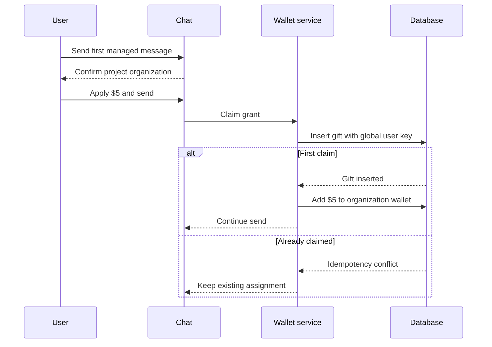
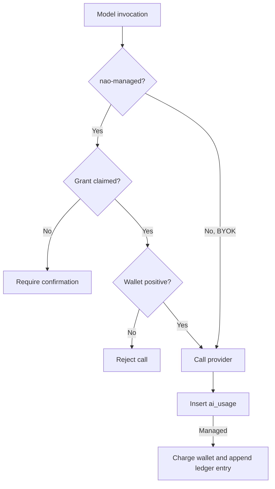
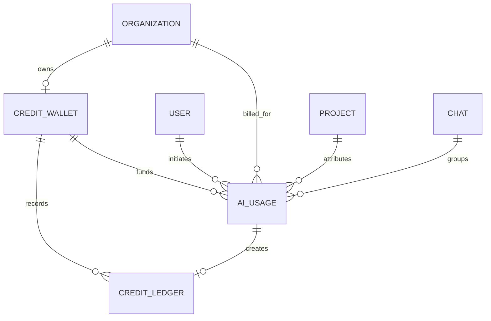

# nao-managed AI credits — V0

Status: implemented
Last reviewed: 2026-10-09

## Decision

nao Cloud gives each eligible user one **$5 managed AI grant** without requiring a provider key. The entitlement is per user, but the balance is stored in the organization where it is claimed because the organization is the billing, access-control, and usage-attribution boundary. Even free managed calls require an active trial.

Each organization has one shared wallet. Member grants accumulate there, any member can consume them, and they stay with the organization when a contributor leaves. A user cannot contribute another grant elsewhere.

This prevents instant onboarding: the first managed send must confirm which project's organization will permanently receive the grant. The extra step prevents a temporary or personal project from silently taking credit intended for the user's company.

V0 excludes checkout, paid top-ups, subscriptions, markup, gateway comparison, and multi-currency behavior.

## Availability and claim

Managed AI is available when nao runs in cloud mode, the managed upstream key is configured, the `nao` provider is enabled, and the project has no BYOK source. Models remain visible while the user can claim a grant or the organization has a positive balance.

Model discovery and credit reads are side-effect free. The first interactive managed send names the current project's organization; confirming calls `ensureWelcomeGrant(orgId, userId)`. The transaction creates the wallet, inserts a $5 `gift`, and increments the balance only when the globally unique `welcome-user:v1:{userId}` key is inserted.

Non-interactive calls cannot claim implicitly and fail until the user confirms interactively. Once claimed, the user may consume another organization's funded wallet when they are a member. Exhaustion hides managed models and blocks inference without deleting projects, chats, schedules, or data. BYOK projects remain independent.

The upstream credential remains a deployment secret and is never stored in a project or returned to a user.

## Accounting and settlement

The shared AI SDK wrapper meters every generated or streamed invocation, including nested calls. An agent run has one `run_id`; each model invocation has a unique `operation_id`, preserving per-call detail for chat, subagents, compaction, memory, titles, automations, stories, cron parsing, context recommendations, and test agents.

Each `ai_usage` row records attribution, category, provider/model, managed or BYOK access, status, provider request ID, token usage, snapshotted rates, calculated costs, and timestamps. Completed calls use provider usage; failed or aborted calls estimate missing tokens from prompt and streamed characters.

Managed usage insertion, wallet charging, and its ledger entry are atomic. The operation ID also makes settlement idempotent. BYOK calls remain observable but have no wallet movement.

## Data model

PostgreSQL and SQLite use the same accounting model:

- `credit_wallet`: one organization balance stored in micro-USD.
- `credit_ledger`: append-only `gift` and `usage` movements with unique idempotency keys.
- `ai_usage`: one row per invocation or billable attempt, grouped by `run_id`.

Foreign keys use `ON DELETE SET NULL` so accounting history survives the removal of attributed entities.

## UI and authorization

The cloud-only **Credits & wallet** page shows the selected organization's balance, grant and spend totals, grouped ledger history, and per-call usage. Admins see all organization usage; other members see only their calls while still seeing the shared wallet.

Chat credit status follows the current project's organization. An eligible user can select managed models before claiming, but the first send pauses for confirmation. Completing a managed chat refreshes balance, ledger, usage, and model queries.

## Known V0 limits

- **No reservation before inference.** A large or concurrent call can make the wallet negative.
- **Metering fails open after provider access.** Persistence failure does not replace a completed response.
- **No started row.** A process crash during inference can lose the usage and charge.
- **Estimated partial usage.** Failed and aborted calls may lack exact provider usage.
- **Price-book accounting only.** Provider invoices are not reconciled.
- **Shared-pool consumption.** Members and automations can consume others' grants.
- **No anti-farming controls.** The per-user key does not prevent multiple accounts.
- **One upstream credential.** Managed organizations share its operational limits.

These are promotional-credit constraints, not paid-balance guarantees.
