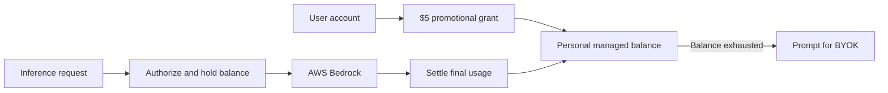
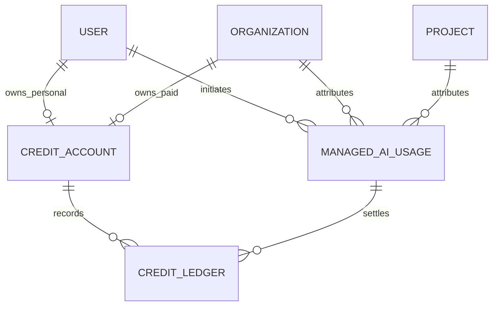

# nao-managed AI credits

Status: discovery  
Last reviewed: 2026-10-08

## Goal

Let organizations use AI models without supplying provider API keys. nao pays the upstream provider, attributes usage, and charges the customer.

The product rolls out in two phases:

- **V0:** every person receives $5 of personal managed Bedrock usage as soon as their account is created, before starting an organization trial. Existing users receive the same grant at launch.
- **V1:** organizations can purchase managed usage through the prepaid system described below.

The V0 grant belongs to the user. People in the same organization each have an independent $5 balance.

nao must not expose its AWS credentials. In the chat product, the authenticated session acts as the user's managed access. If an actual API key is part of V0, it is a scoped nao key backed by the user's balance, never a Bedrock key.

## Provider shortlist

| Provider          | Strengths                                                                                                 | Weaknesses                                                                         | Suggested role                     |
| ----------------- | --------------------------------------------------------------------------------------------------------- | ---------------------------------------------------------------------------------- | ---------------------------------- |
| AWS Bedrock       | Already supported by nao, several model families through one AWS account, strong usage and quota controls | Model pricing and features vary; nao must calculate cost and manage AWS limits     | V0 free allowance                  |
| OpenRouter        | Broadest model catalog, existing nao integration, routing, programmatic keys, request-level costs         | Additional processor, variable upstream behavior, some controls require paid plans | Simplest multi-model pilot         |
| Vercel AI Gateway | AI SDK alignment, fallbacks, reporting, budgets, ZDR, no advertised token markup                          | Some features target AI SDK 7 while nao uses AI SDK 6; reporting is asynchronous   | Multi-model production candidate   |
| Direct OpenAI     | No gateway, native features, simpler vendor chain, possible volume discounts                              | OpenAI models only; nao owns failover, quotas, price updates, and reconciliation   | Simple single-provider alternative |

### AWS Bedrock

- nao already has a Bedrock provider implementation.
- A nao-owned AWS credential can expose a small curated model list.
- Bedrock returns token usage; nao calculates the request cost from a versioned Bedrock price book.
- The $5 allowance limits nao's exposure while customers evaluate the product.
- AWS account quotas, model access, and abuse controls still need operational limits.

Sources: [Converse API](https://docs.aws.amazon.com/bedrock/latest/userguide/conversation-inference.html), [model compatibility](https://docs.aws.amazon.com/bedrock/latest/userguide/models-api-compatibility.html), [runtime quotas](https://docs.aws.amazon.com/bedrock/latest/userguide/quotas-runtime.html).

### OpenRouter

- nao already includes `@openrouter/ai-sdk-provider`.
- One API provides access to many models and upstream providers.
- Streaming responses and generation lookup expose usage and cost.
- Programmatic keys support limits, expiry, resets, and external identity.
- A curated model allowlist is still required to control support and pricing.
- OpenRouter limits are safeguards, not the customer balance.

Sources: [usage](https://openrouter.ai/docs/cookbook/administration/usage-accounting), [keys](https://openrouter.ai/docs/guides/overview/auth/management-api-keys), [routing](https://openrouter.ai/docs/guides/routing/provider-selection).

### Vercel AI Gateway

- Closely aligned with the Vercel AI SDK used by nao.
- Supports multiple providers, model fallback, BYOK, budgets, and ZDR.
- Generation IDs provide cost, usage, provider, latency, and routing attempts.
- Current pricing advertises no token markup.
- AI SDK 6 compatibility must be proven before committing.
- Asynchronous reporting cannot authorize a live request.

Sources: [pricing](https://vercel.com/docs/ai-gateway/pricing), [usage](https://vercel.com/docs/ai-gateway/observability-and-spend/usage), [budgets](https://vercel.com/docs/ai-gateway/observability-and-spend/budgets).

### Direct OpenAI

- Removes the gateway dependency and exposes OpenAI-native features first.
- OpenAI supports streaming, tools, caching, usage reporting, and organization rate limits.
- It is simpler operationally than integrating several providers directly.
- Customers cannot choose Anthropic, Gemini, or other model families.
- nao must manage OpenAI outages, quotas, price changes, and account-level risk.
- Adding another direct provider later creates another separate integration.

Sources: [pricing](https://developers.openai.com/api/docs/pricing), [rate limits](https://developers.openai.com/api/docs/guides/rate-limits), [data controls](https://developers.openai.com/api/docs/guides/your-data), [services agreement](https://openai.com/policies/services-agreement/).

## V1 pricing options

| Model                                    | How it works                                                                                               | Strengths                                                                                                   | Weaknesses                                                                                              |
| ---------------------------------------- | ---------------------------------------------------------------------------------------------------------- | ----------------------------------------------------------------------------------------------------------- | ------------------------------------------------------------------------------------------------------- |
| Prepaid balance with checkout commission | Customer deposits $X, nao takes 5%, and the remaining balance pays for requests at their base retail price | Simple request pricing, visible nao fee, hard spending limit                                                | Checkout fee may discourage larger deposits; little margin remains after payment costs                  |
| Prepaid balance with request markup      | Customer receives the full deposited balance; each request includes nao's 5% markup                        | Cleaner checkout, margin follows usage, hard spending limit                                                 | Usage prices are higher and harder to compare with provider prices                                      |
| nao credits                              | Customer pays $X for Y nao credits; each request consumes credits according to model and usage             | Simple product language, supports promotions and included credits, hides provider-specific dollar fractions | Less transparent, requires conversion and valuation rules, can resemble stored value if poorly designed |

### Option 1: prepaid balance with checkout commission

Example:

- Customer pays **$100**.
- nao takes the working **5% checkout commission**.
- nao adds **$95** to the usable balance.
- Each request deducts its published retail cost from the $95 balance.

Five percent is only a discovery assumption. After card fees, FX, failed requests, fraud, and support, the remaining margin may be too low. A minimum deposit avoids losing margin to fixed payment fees.

### Option 2: prepaid balance with request markup

Example:

- Customer pays **$100**.
- nao adds the full **$100** to the usable balance.
- A request with a $1 base retail cost consumes **$1.05**.
- The **$0.05 difference** is nao's markup.

This produces a cleaner checkout and makes nao's revenue proportional to actual usage. The displayed model rates must include the markup so customers know the price before making a request.

### Option 3: nao credits

Example:

- Customer pays **$10** and receives **1,000 nao credits**.
- A small-model request might consume 2 credits.
- A long premium-model request might consume 80 credits.
- The displayed model catalog shows estimated credit rates.

Do not promise a fixed number of unrestricted requests. Model, prompt, output, tool, and caching costs vary too much. A fixed request bundle is safe only when nao restricts the model, context, output, tools, and maximum steps.

Economically, nao credits remain a prepaid balance with a custom display unit. They do not eliminate the need for exact usage metering or a price book.

Do not apply both the checkout commission and request markup without clearly disclosing the total effective markup.

## Rollout

### V0: free Bedrock allowance

1. Every existing user receives one **$5 promotional balance** at launch.
2. Every new account receives the same grant immediately after signup.
3. The grant works before the user starts an organization trial.
4. Users in the same organization spend their own balances independently.
5. nao exposes only curated Bedrock models verified with nao agents.
6. Every managed request deducts its Bedrock cost from the initiating user's balance.
7. No Stripe customer, checkout, paid top-up, commission, or EUR conversion is needed.
8. At exhaustion, block that user's new managed requests and show a BYOK setup action.
9. Existing chats, projects, schedules, and data remain available.
10. A configured BYOK provider bypasses the managed balance and continues using the customer's provider account.

### V1: paid managed usage

1. Add Stripe top-ups and a prepaid monetary balance.
2. Use **5%** only as a temporary modeling assumption; the final rate and where it is charged remain undecided.
3. Support EUR and USD in the EU and North America.
4. Add OpenRouter, Vercel AI Gateway, or direct OpenAI after evaluation.
5. Optionally display the monetary balance as nao credits.
6. Purchased balances do not expire and are non-refundable except where required by law or for billing errors.

## Credits architecture

- The nao ledger is the real-time source of truth.
- Reserve a bounded amount before inference.
- Settle the final charge and release the remainder.
- Identify each charge by a stable nao operation ID.
- Preserve projects and data when the balance runs out; block only new managed inference.
- V1 adds Stripe Checkout as another source of balance grants.

## Rough implementation

### Existing tables to reuse

- `user` owns the V0 promotional balance.
- `organization` and `project` remain usage-attribution dimensions but do not own the V0 balance.
- `chat_message` and `llm_inference` keep product analytics and token usage, but are not financial records because their costs are reconstructed from mutable prices.
- `project_llm_config` remains for customer BYOK credentials. The nao Bedrock credential stays in the deployment secret manager, not in each project row.
- `project_provider_budget` can remain an optional project guardrail, but it is not an organization balance.
- The existing `api_key` table is organization-scoped. If V0 requires a real external nao key, add a `managed_ai` scope and charge usage to `created_by`; do not reuse an unscoped organization key.
- V1 reuses `organization_billing` and `stripe_webhook_event` from the cloud-billing branch for Stripe customers and the idempotent webhook inbox.

### New tables

| Table              | Purpose                                                                | Important fields                                                                                                                                                                                                                                |
| ------------------ | ---------------------------------------------------------------------- | ----------------------------------------------------------------------------------------------------------------------------------------------------------------------------------------------------------------------------------------------- |
| `credit_account`   | Current personal V0 or organization V1 balance and concurrency control | `id`, nullable unique `user_id`, nullable unique `org_id`, `currency`, `available_micros`, `held_micros`, timestamps; exactly one owner must be set                                                                                             |
| `credit_ledger`    | Immutable audit of every account balance movement                      | `id`, `account_id`, optional `usage_id`, `entry_type`, `available_delta_micros`, `held_delta_micros`, unique `idempotency_key`, external payment reference, metadata, `created_at`                                                              |
| `managed_ai_usage` | One billable upstream generation or attempt                            | `id`, `account_id`, initiating `user_id`, `org_id`, `project_id`, operation ID, provider, model, external generation ID, status, token counts, upstream cost, retail charge, held amount, currency, price version and rate snapshot, timestamps |

Use integer millionths of the billing currency so sub-cent requests accumulate accurately in both PostgreSQL and SQLite. Round only when displaying balances or charging Stripe.

A separate price table is unnecessary for V0. Keep a versioned Bedrock price book in code and copy the applied rates and version into `managed_ai_usage`. Add a database-managed catalog only if prices must change without deployment.

### V0 grant creation

For existing users, run an idempotent launch backfill. For new users, initialize the grant from the post-signup flow:

1. Transactionally create a user-owned `credit_account` with USD currency.
2. Append one `promotional_grant` ledger entry for `5_000_000` microdollars.
3. Use `v0-bedrock-grant:{userId}` as the unique idempotency key.

The same helper can run lazily during the first managed-access check, making retries safe and ensuring each user receives exactly one grant regardless of organization membership.

### Request lifecycle

1. Resolve the authenticated or API-key-owning user and their credit account.
2. Atomically move a maximum estimated amount from available to held balance. Reject when available balance is insufficient.
3. Call the model through AI SDK 6 `wrapLanguageModel` middleware so both generated and streamed calls use the same metering path.
4. Capture the Bedrock model, token usage, and nao operation ID.
5. Calculate the Bedrock cost from the snapshotted price version.
6. In one transaction, insert `managed_ai_usage`, append settlement ledger entries, update the account, and release unused hold.
7. On failure, release the hold unless Bedrock confirms a partial billable amount.

The middleware must cover interactive agents and background inferences such as subagents, compaction, memory, titles, live stories, and automations. Background work is charged to the user who initiated or owns it; unattributed system work must not consume another user's grant.

### Provider-specific work

| Provider          | Rough implementation                                                                                                                                                                                  | Additional tables |
| ----------------- | ----------------------------------------------------------------------------------------------------------------------------------------------------------------------------------------------------- | ----------------- |
| AWS Bedrock       | Reuse the existing Bedrock factory with nao-owned AWS credentials, expose curated models, capture usage, and calculate cost from the Bedrock price book                                               | None              |
| OpenRouter        | Reuse the existing OpenRouter factory with a nao-owned secret, expose a curated model list, attach organization/project attribution, capture generation IDs, and reconcile through the generation API | None              |
| Vercel AI Gateway | Add the gateway model factory, attach reporting tags, capture `providerMetadata.gateway.generationId`, and reconcile through the generation API                                                       | None              |
| Direct OpenAI     | Reuse the existing OpenAI factory with a nao-owned secret, capture response usage, calculate cost from the nao price book, and reconcile against OpenAI billing reports                               | None              |

Use one shared nao AWS credential for V0. Per-user upstream credentials are unnecessary because the nao ledger provides customer accounting.

### V1 pricing-specific work

| Pricing option      | Checkout credit                                                                | Request settlement                                         |
| ------------------- | ------------------------------------------------------------------------------ | ---------------------------------------------------------- |
| Checkout commission | A $100 successful payment appends a $95 available-balance grant                | Deduct the published base retail price                     |
| Request markup      | A $100 successful payment appends a $100 available-balance grant               | Deduct the published price including the working 5% markup |
| nao credits         | Grant the same underlying monetary balance and convert it to credits in the UI | Convert the retail monetary charge to display credits      |

V0 does not use Stripe. In V1, Stripe Checkout metadata carries the organization, currency, gross payment, granted balance, and pricing mode. The successful-payment webhook appends the grant exactly once using the Payment Intent or Checkout Session as the ledger idempotency key.

Purchased balances do not expire and are normally non-refundable, but chargebacks, legal refunds, and billing corrections must create compensating ledger entries rather than modifying or deleting history.

## Remaining questions

- Which Bedrock models pass the V0 nao agent compatibility evaluation?
- Does “API key” mean an actual external nao API key, or simply immediate managed access in the authenticated chat product?
- If an external key is required, which API routes and projects may it access?
- Is post-exhaustion BYOK personal or project-wide? The current `project_llm_config` is project-wide.
- What basic signup controls prevent automated creation of unlimited $5 grants?
- For V1, is the margin charged at checkout or included in request rates?
- For V1, what minimum top-up keeps payment fees economical?
