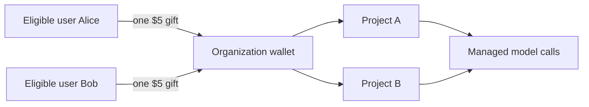
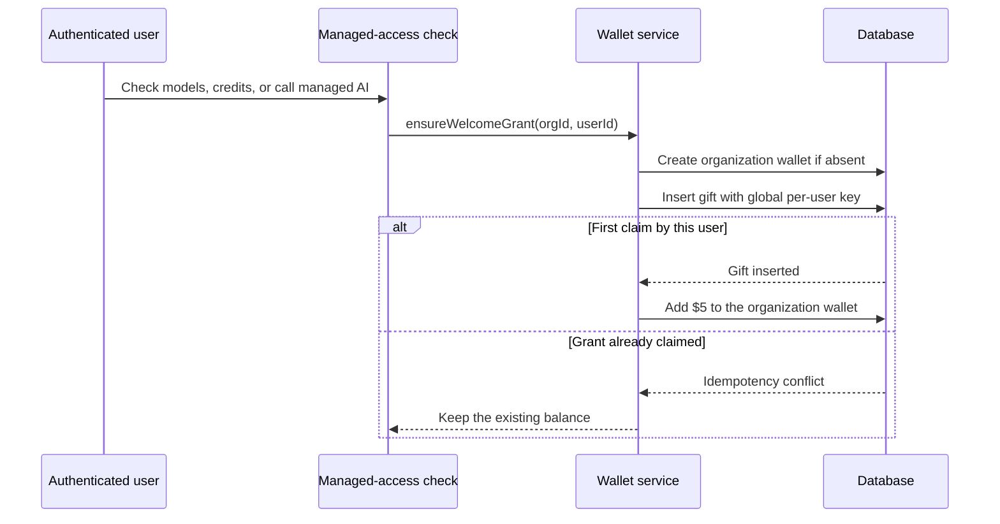
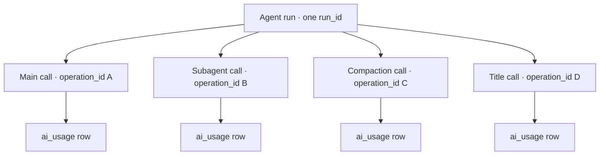
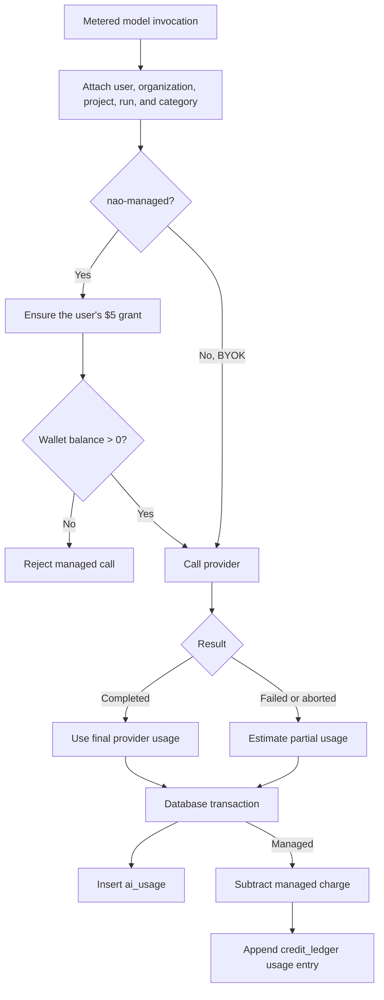
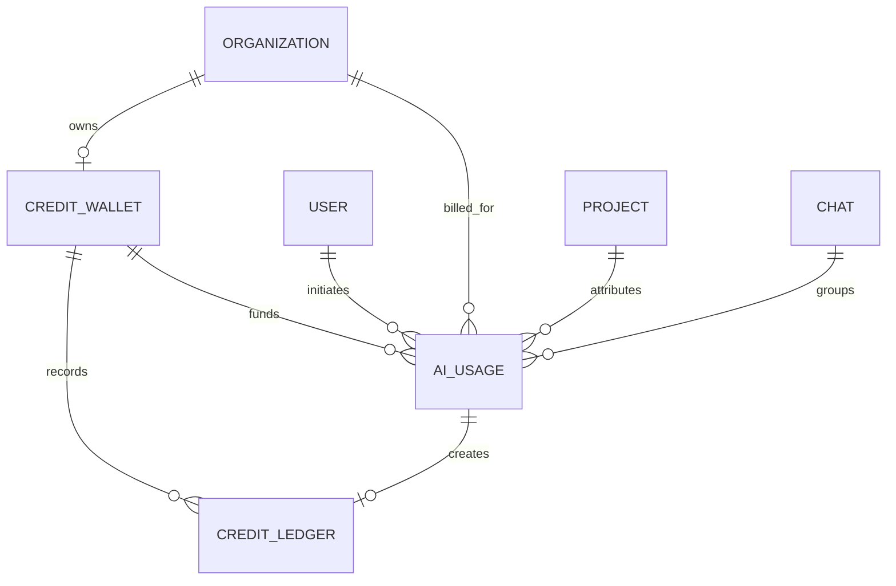

# nao-managed AI credits — V0

Status: implemented
Last reviewed: 2026-10-09

## Purpose

nao Cloud gives every eligible user **$5 of managed AI credit** without requiring a provider API key.

The credit is organization-related:

- Each user can contribute one $5 grant.
- The grant goes to the organization where that user first claims managed access.
- An organization has one shared wallet.
- Grants from several users accumulate in that wallet.
- Any organization member can consume the shared balance.
- A user's grant stays with the organization if the user leaves.
- The same user cannot contribute another $5 to another organization.

The second V0 requirement is complete model-call accounting: every metered model invocation must receive its own database record, including calls made inside a larger agent run. This makes chat, subagent, background, BYOK, token, cost, and wallet activity traceable from one place.

V0 has no checkout, paid top-up, subscription, markup, gateway comparison, or multi-currency behavior.

## Availability

Managed AI is enabled only when:

1. nao runs in cloud mode.
2. `NAO_MANAGED_OPENAI_API_KEY` is configured.
3. The `nao` provider is not disabled.
4. The project has no configured BYOK provider source.
5. The organization wallet has a positive balance.

The upstream credential remains a deployment secret. It is never stored in a project or returned to a user.

When the wallet is exhausted, nao removes managed models from the available model list and blocks new managed calls. Projects, chats, schedules, and existing data remain available. A project with BYOK credentials continues to use its own provider independently of the managed wallet.

## Organization wallet

The wallet belongs to an organization, not to a user or project.

### Lazy grant creation

There is no signup hook and no backfill. The grant is claimed lazily when an authenticated member first checks managed access, opens the credits data, or starts a managed call.

`ensureWelcomeGrant(orgId, userId)` performs the claim in a database transaction:

1. Create the organization's wallet if it does not exist.
2. Insert a `gift` ledger entry for `5_000_000` micro-USD.
3. Use `welcome-user:v1:{userId}` as the globally unique idempotency key.
4. Store the contributing user in ledger metadata.
5. Increase the wallet balance only if the gift entry was inserted.

The idempotency key is global across organizations. If Alice contributes to Organization A and later joins Organization B, Organization B does not receive another grant from Alice.

## Every model invocation is an accounting event

The AI SDK model is wrapped at the shared provider-resolution boundary. The wrapper meters both generated and streamed calls, so accounting does not depend on one chat route or one agent implementation.

The current call categories are:

- chat
- subagent
- compaction
- memory
- title generation
- automation
- story generation
- cron parsing
- context recommendation
- test agent

An agent run receives one `run_id`. Every upstream model invocation inside that run receives a unique `operation_id`. Main-agent steps, subagents, compaction, memory, and title calls can therefore be grouped as one run without losing per-call detail.

### Recorded data

Each `ai_usage` row can attribute a call to:

- operation and run
- initiating user
- billed organization
- project
- chat and assistant message
- category
- provider and model
- managed or BYOK access
- completion, abortion, or failure status
- finish reason and provider request ID
- input, cache-read, cache-write, output, and reasoning tokens
- snapshotted token rates and calculated category costs
- upstream cost and customer charge
- cost source
- start and completion timestamps

Completed calls use provider-reported token usage. Failed and aborted calls use an estimate when final usage is unavailable: serialized prompt and streamed output characters divided by four.

Rates come from the built-in model metadata or the project's custom model declaration. Applied rates and calculated costs are copied into the usage row so historical records do not change when the price book changes.

## Request and settlement lifecycle

For a managed call:

1. Require an initiating user, billed organization, and configured model rates.
2. Ensure the user's grant and verify that the shared wallet is positive.
3. Call the upstream model.
4. Record one `ai_usage` row.
5. Subtract the calculated cost from the wallet.
6. Append one `usage` ledger entry.

The usage row, wallet update, and ledger entry are written in one transaction. `operation_id` is unique, and the ledger uses the same value as its idempotency key, so retrying settlement cannot charge the wallet twice.

For a BYOK call, nao still writes `ai_usage` when a usage context is supplied. The row has `is_managed = false`, a zero customer charge, and no wallet or ledger movement.

Generated calls record completion or provider failure. Streamed calls additionally record client abortion and stream error events. HTTP request abortion stops the agent so the stream meter can settle estimated usage.

## Database model

V0 adds the same accounting schema to PostgreSQL and SQLite.

### `credit_wallet`

- One wallet per organization through a unique `org_id`.
- Stores the current `balance_micro_usd`.
- Uses integer millionths of a US dollar to preserve sub-cent charges.

### `credit_ledger`

- Append-only balance history.
- `gift` entries add the one-time $5 grants.
- `usage` entries subtract managed-call charges.
- Stores the balance after every movement.
- Uses unique usage and idempotency keys to prevent duplicate charges.
- Keeps grant metadata, including the contributing user.

### `ai_usage`

- One row per metered upstream model invocation or billable attempt.
- Keeps exact attribution, status, tokens, rates, costs, and timestamps.
- Uses a unique `operation_id`.
- Uses `run_id` to group all calls belonging to one agent run.
- Remains separate from the wallet ledger because BYOK calls have usage but no nao credit movement.

Foreign keys use `ON DELETE SET NULL`, preserving accounting history when an attributed user, organization, project, chat, wallet, or usage relation disappears.

## Queries and UI

The cloud-only **Credits & wallet** settings page exposes:

- available organization balance
- lifetime granted credits
- lifetime used credits
- wallet usage history grouped by agent run, with gifts shown separately
- model-call history grouped by `run_id`
- per-call category, status, model, token counts, and cost
- links from attributed chat runs back to the chat

Wallet summary and ledger visibility follow the selected organization membership. Organization admins can inspect all usage for the organization. Other members see only their own usage calls while still seeing the shared organization balance and ledger.

Usage and ledger endpoints use cursor pagination. Completing a managed chat invalidates the balance, ledger, usage, and available-model queries so the UI refreshes after settlement.

## Current guarantees

- One $5 contribution per user across all organizations.
- One shared wallet per organization.
- Several users can contribute to the same organization.
- Managed calls require a positive organization balance before provider access.
- Every wrapped model invocation gets independent operation and attribution IDs.
- Main and nested calls can be grouped into one agent run.
- Managed usage insertion, wallet charging, and ledger insertion are atomic.
- Duplicate operation settlement does not charge twice.
- BYOK usage is observable but never charged to the nao wallet.
- Exhaustion blocks managed inference without deleting customer data.

The focused tests cover grant idempotency, multi-user pooling, missing organization rejection, generated and streamed calls, BYOK usage, aborted and failed calls, exhausted wallets, duplicate operation settlement, organization and user scoping, and cursor pagination.

## Known V0 limits

These limits describe the implementation as it exists:

- **No reservation before inference.** The preflight check only requires a positive balance. A large call or concurrent calls can make the wallet negative.
- **Metering fails open after provider access.** Recording errors are logged and do not replace a completed response. An upstream call can therefore exist without a durable usage row if persistence fails.
- **No started row.** A process crash during provider inference can lose that call's usage and charge.
- **Estimated partial usage.** Failed and aborted calls use a coarse characters-per-token estimate when the provider supplies no final usage.
- **Price-book accounting only.** V0 stores provider request IDs but does not reconcile rows against provider invoices.
- **Shared-pool consumption.** Any member or automation can consume credits contributed by another member of the organization.
- **No anti-farming controls in this feature.** The global per-user key prevents repeated grants by one account, but does not prevent creation of many accounts.
- **One shared upstream credential.** Managed organizations share nao's OpenAI credential and its operational limits.

These are acceptable constraints for promotional V0 credit. They are not paid-balance guarantees.
